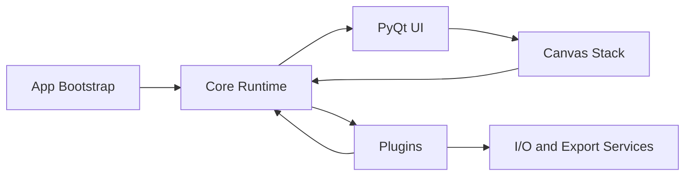
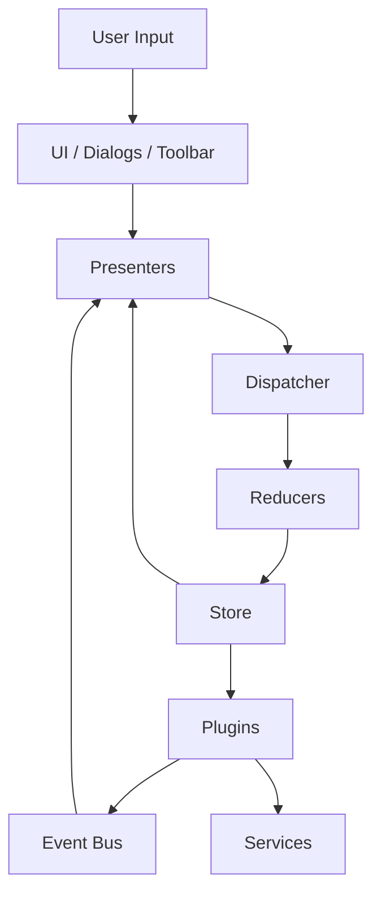
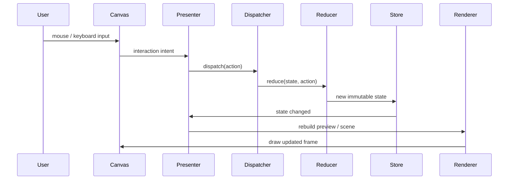
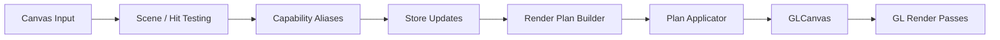
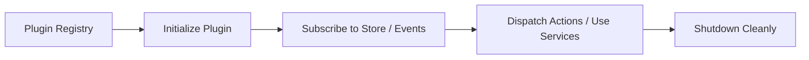

# ImgSLI Architecture

Improve ImgSLI is a PyQt6 desktop application for image comparison and video export. The codebase is split into a small number of stable layers so UI interaction, state updates, plugins, and rendering stay loosely coupled.

## System View

### Responsibilities

| Area | What it owns |
|---|---|
| `core/` | bootstrap, dispatcher, store, event bus, plugin lifecycle |
| `ui/` | main window, presenters, dialogs, canvas widget, transient UI |
| `plugins/` | feature modules such as comparison, export, settings, video editor |
| `shared/` | reusable rendering and image-processing contracts |
| `services/` | filesystem, clipboard, notifications, image loading |

## Runtime Layers

### Why it is structured this way

- UI widgets stay thin and mostly forward intent.
- Reducers remain the single place where persistent state changes.
- Plugins can react to state and emit events without hard-wiring themselves into the main window.
- Services isolate OS and I/O work from rendering and state logic.

## Main Data Flow

This loop is the default path for splitter movement, magnifier interaction, toggles, and most other canvas actions.

## Canvas Stack

The canvas is treated as its own subsystem because it mixes interaction, scene building, and OpenGL rendering.

### Canvas responsibilities

| Part | Role |
|---|---|
| `ui/canvas_infra/` | feature registry, scene contracts, hit-testing, stacking rules |
| `ui/canvas_presentation/` | turns store state into a render plan |
| `ui/widgets/gl_canvas/` | OpenGL widget, render executor, texture management |
| `ui/canvas_features/` | self-contained visual features such as divider, magnifier, guides |

### Important constraint

Canvas features are discovered automatically. A feature package should be removable without breaking startup, as long as no other code imports it directly.

## Plugins

Plugins hold app-level functionality that is bigger than a single widget but smaller than a separate application.

Current plugins include comparison, export, video editor, settings, analysis, viewport, and layout-related behavior.

## State Model

The store is intentionally small at the top level.

| State branch | Purpose |
|---|---|
| `document` | loaded files, playlist, image metadata |
| `viewport` | split position, zoom, feature state, interaction flags |
| `settings` | theme, language, performance and UI preferences |
| `workspace` | broader session/workspace information |

### Rules

- Actions are immutable payloads.
- Reducers do not perform I/O.
- UI derives from store state instead of mutating widgets ad hoc.
- Feature-specific canvas state lives under `viewport.view_state.canvas_widget_state`.

## Rendering Model

Rendering is split into two stages:

1. Build a render plan from current store state.
2. Execute ordered GL passes inside `GLCanvas`.

This keeps export, thumbnails, and interactive preview aligned around the same layout and rendering contracts.

## Extension Points

If you need to add functionality, use the smallest viable integration point:

| Need | Best place |
|---|---|
| new persistent setting | `settings` state + reducer + dialog binding |
| new canvas overlay/tool | `ui/canvas_features/` |
| new app workflow | plugin |
| reusable rendering/layout primitive | `shared/rendering/` |
| OS or file integration | `services/` |

## Practical Reading Order

For onboarding into the codebase, read files in this order:

1. `src/core/bootstrap.py`
2. `src/ui/main_window.py`
3. `src/ui/presenters/`
4. `src/core/state_management/`
5. `src/ui/canvas_infra/` and `src/ui/canvas_presentation/`
6. the specific plugin or canvas feature you want to modify
