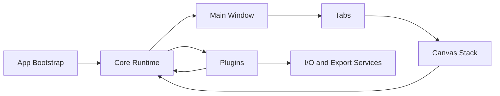
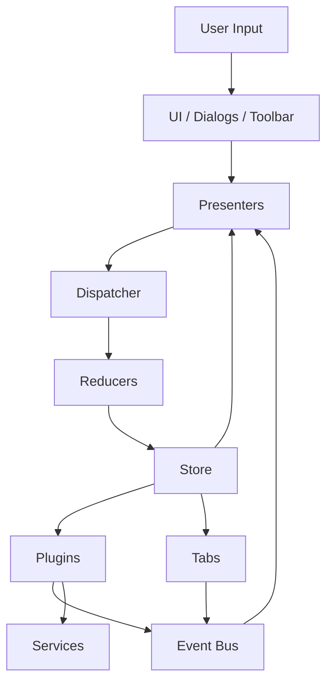
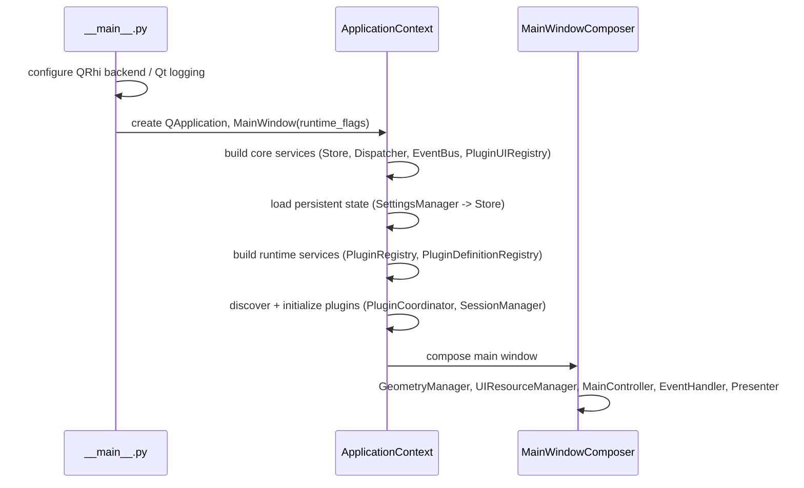
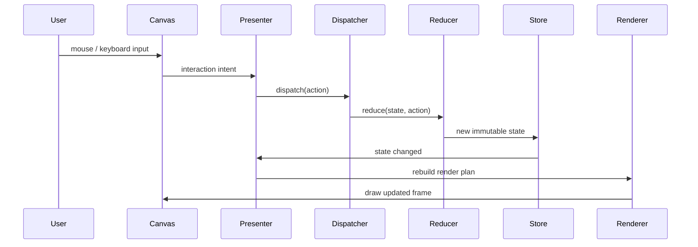
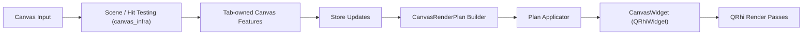
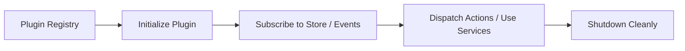

# ImgSLI Architecture

Improve ImgSLI is a PySide6 desktop application for image comparison and video export. The codebase is split into a small number of stable layers so UI interaction, state updates, plugins, tabs, and rendering stay loosely coupled.

## System View

### Responsibilities

| Area | What it owns |
|---|---|
| `core/` | bootstrap, dispatcher, store, state_management (reducers/actions), plugin_system, event bus |
| `domain/` | Qt-agnostic data shapes (workspace/session model, geometry types) and Qt adapters |
| `ui/` | main window shell, presenters, canvas infra shared across tabs, dialogs, transient UI |
| `plugins/` | capability modules that are not tied to a single tab: export, settings, help, image_properties, layout, video file I/O |
| `tabs/` | self-contained workspace modes (image_compare, multi_compare, session_picker), each owning its own widget tree, state slot, and canvas features |
| `shared/` | app-specific rendering and image-processing utilities (analysis, offscreen render, interpolation) |
| `shared_toolkit/` | vendored `sli-ui-toolkit` — base widgets, theming, i18n, gesture resolvers |
| `services/` | filesystem, notifications, system integration |

## Runtime Layers

### Why it is structured this way

- UI widgets stay thin and mostly forward intent.
- Reducers remain the single place where persistent state changes; tabs contribute their own reducers/actions for tab-owned state (see [STORE.md](STORE.md)).
- Plugins provide app-wide capabilities (export, settings, help) without hard-wiring into the main window.
- Tabs are the unit of "workspace mode" — each owns its widget tree, an i18n namespace, a state slot, and (for canvas-based tabs) its own auto-discovered canvas features.
- Services isolate OS and I/O work from rendering and state logic.

## Bootstrap Sequence

`core/bootstrap.py` (`ApplicationContext`) owns steps up through plugin initialization; `ui/main_window/composer.py` (`MainWindowComposer`) assembles the window shell on top of it.

## Main Data Flow

This loop is the default path for splitter movement, magnifier interaction, toggles, and most other canvas actions. Details of actions/reducers/store scopes are in [STORE.md](STORE.md).

## Tabs

A tab is a self-contained workspace mode: it owns its widget tree, a state slot (via `WorkspaceSession.state_slots`), an i18n namespace, and — if canvas-based — its own set of auto-discovered canvas features.

| Tab | Role |
|---|---|
| `tabs/image_compare/` | Primary two-image comparison: full canvas, overlays, guides, capture circles, split view, video editor integration |
| `tabs/multi_compare/` | Grid-layout multi-image comparison, composition-aware rendering |
| `tabs/session_picker/` | Workspace session browser / switcher |

Each tab implements a `TabContract` (`tab.py`) responsible for page creation and session lifecycle.

### Extending tab capabilities

Beyond the fixed lifecycle hooks (`create_page`, `on_activated`, `accepts_drop`, ...),
host code and tabs exchange capabilities through a small set of sanctioned
mechanisms — `create_service` (the default), `notify_all` (broadcast-only),
and `CanvasGeometryProvider` (typed protocol, canvas hot-path only). Full
reference, current status, and the "never do this instead" rules (no 11th
abstract method on `TabContract`, no `getattr(widget, "btn_x", None)`
implied lookups) live in [TAB_CONTRACT.md](TAB_CONTRACT.md)'s "Capability
mechanisms" section — that is the single source of truth for this topic, not
duplicated here.

## Canvas Stack

The canvas is treated as its own subsystem per tab because it mixes interaction, scene building, and QRhi rendering. Shared canvas infrastructure lives in `ui/canvas_infra/` and `ui/canvas_presentation/`; each canvas-owning tab (currently `image_compare`) has its own `canvas/` package built on top of that infrastructure.

### Canvas responsibilities

| Part | Role |
|---|---|
| `ui/canvas_infra/` | shared viewport geometry/zoom/focus, scene hit-testing, stacking rules, gesture resolution — used by all canvas-owning tabs |
| `ui/canvas_infra/viewport/contract.py` | `CanvasGeometryProvider` protocol — the one `TabContract`-adjacent extension point for hot-path canvas coordinate math (see "Extending tab capabilities" above) |
| `ui/canvas_presentation/` | shared render-plan contracts (`CanvasRenderPlan`, `CompositionNode`, `plan_applicator`) |
| `tabs/image_compare/canvas/` | tab-specific `CanvasWidget` (QRhiWidget), renderer, scene, interaction, state, shaders, textures |
| `tabs/image_compare/canvas/presentation/` | tab-specific render plan assembly |
| `tabs/image_compare/canvas/features/` | auto-discovered canvas features (masks, analysis, rulers, guides, etc.) |

Rendering uses **QRhi**, not raw OpenGL — see [QRHI_CANVAS_FEATURES.md](QRHI_CANVAS_FEATURES.md) for the feature contract and auto-discovery mechanism.

### Important constraint

Canvas features are discovered automatically from `tabs/<tab>/canvas/features/<name>/`. A feature package should be removable without breaking startup, as long as no other code imports it directly.

## Plugins

Plugins hold app-level capabilities that are not tied to a single tab.

| Plugin | Role |
|---|---|
| `plugins/export/` | export pipeline integration (image/video) |
| `plugins/settings/` | settings dialog + `SettingsManager` (disk persistence) |
| `plugins/help/` | in-app help widget |
| `plugins/image_properties/` | image metadata display |
| `plugins/layout/` | multi-column / side-by-side layout management |

Note: `video_editor` (file I/O, dialogs, timeline, keyframing, and
preview-canvas integration) lives under `tabs/image_compare/plugins/video_editor/` —
it is tab-owned code, not a `plugins/<name>/` entry, since it has no consumer
outside `tabs/image_compare/`. It still registers itself as a `Plugin` (via
an explicit import from `tabs/image_compare/plugin.py`, since
`PluginRegistry`'s scan of `tabs/` is one level deep) so the rest of the
plugin lifecycle (event bus, `get_plugin("video_editor")` lookups) is
unaffected by where the code lives.

The keyframe snapshot contracts (`FrameSnapshot`, `ChannelDescriptor`,
`TrackDescriptor`, `ToolDescriptor`, `KeyframeToolAdapter`) live in
`shared/keyframing/` rather than under `tabs/image_compare/plugins/video_editor/`,
because genuinely platform-level code (`ui/canvas_infra/scene/` property
access, capability alias contracts) needs to reference these types without
importing a tab package — `tests/contracts/test_platform_isolation.py`
enforces that platform code never imports `tabs.*` directly. The concrete
`RecordingFlow`/`VideoExportFlow` service classes stay tab-owned; `plugins/
export/controller.py` obtains instances through
`VideoEditorPlugin.create_control_flows(controller)` instead of importing
them directly, mirroring the existing `create_recording_services` pattern.

## State Model

The store is intentionally small at the top level (`core/store.py`).

| State branch | Purpose |
|---|---|
| `document` | loaded files, playlist, image metadata |
| `viewport` | `view_state` (split position, diff/channel mode, canvas feature state), `interaction_state` (drag/keyboard flags), `geometry_state` (pixmap/label geometry), `render_config` (interpolation, text overlay styling), `session_data` |
| `settings` | theme, language, performance and UI preferences |
| `workspace` | sessions/tabs, active session, per-session state slots |
| `runtime_cache` | ephemeral, non-persistent GPU/rendering cache (`ViewportRuntimeCache`) |

### Rules

- Actions are immutable payloads (`core/state_management/*_actions.py`).
- Reducers do not perform I/O.
- The `Dispatcher` (`core/state_management/dispatcher.py`) is the single, thread-safe mutation gate.
- Tabs contribute their own reducers/actions for tab-owned state (extension reducers) rather than editing core reducers directly.
- UI derives from store state instead of mutating widgets ad hoc.

See [STORE.md](STORE.md) for the full store/dispatcher/reducer contract.

## Rendering Model

Rendering is split into two stages:

1. Build an immutable `CanvasRenderPlan` from current store state.
2. Execute it as ordered QRhi passes inside the tab's `CanvasWidget`.

This keeps export, thumbnails, and interactive preview aligned around the same layout and rendering contracts. Offscreen/headless rendering of the same plan is available via `shared/rendering/offscreen_canvas.py` for export and thumbnails.

### Viewport focus

Canvas pan is stored in pre-letterbox UV space, while the sampled image point is derived through the letterbox parameters. When a render plan is re-applied or the canvas is resized, preserving raw `pan_offset_x/y` is not enough: a one-pixel letterbox/content-rect change moves the camera in image space, especially at high zoom. Preserve the image sample point under the viewport center, then recompute pan for the new letterbox.

## Extension Points

If you need to add functionality, use the smallest viable integration point:

| Need | Best place |
|---|---|
| new persistent setting | `settings` state + reducer + dialog binding |
| new canvas overlay/tool (image_compare tab) | `tabs/image_compare/canvas/features/` |
| new tab-owned state | tab's `state/` package + extension reducer (see [STORE.md](STORE.md)) |
| new app-wide capability | `plugins/` |
| new workspace mode | `tabs/` |
| reusable rendering/layout primitive | `shared/rendering/` |
| OS or file integration | `services/` |

## Practical Reading Order

For onboarding into the codebase, read files in this order:

1. `src/__main__.py` and `src/core/bootstrap.py`
2. `src/ui/main_window/composer.py`
3. `src/core/state_management/` and [STORE.md](STORE.md)
4. `src/ui/canvas_infra/` and `src/ui/canvas_presentation/`
5. `src/tabs/image_compare/tab.py`, then `src/tabs/image_compare/canvas/` and [QRHI_CANVAS_FEATURES.md](QRHI_CANVAS_FEATURES.md)
6. the specific plugin or tab you want to modify
