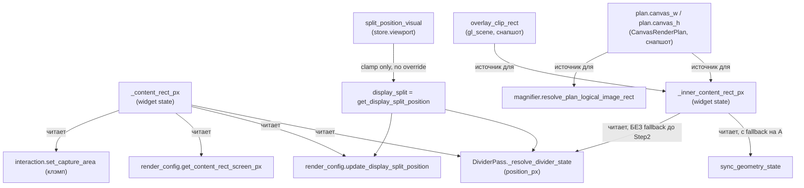
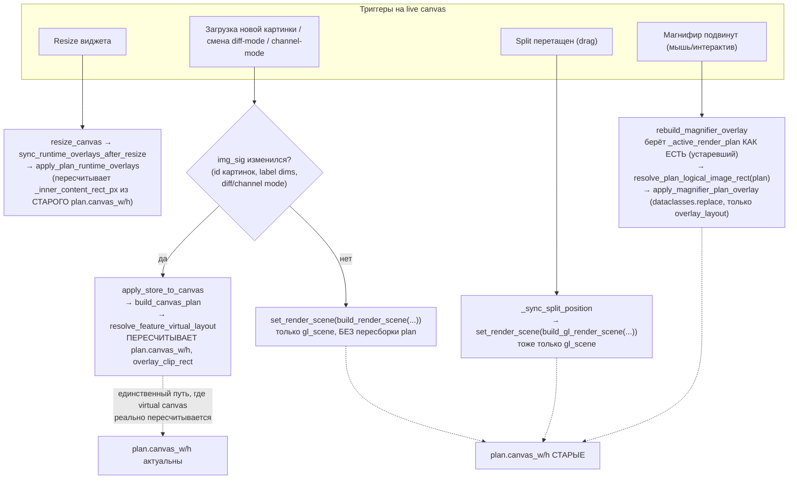
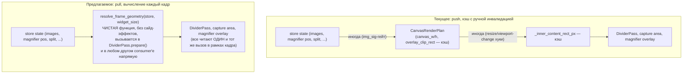

# Render Plan Geometry — Current Architecture as Graphs

Companion к [UNCROP_FIT_CONTENT_AUDIT.md](./UNCROP_FIT_CONTENT_AUDIT.md) (детальный
аудит с конкретными находками) и [QRHI_CANVAS_FEATURES.md](./QRHI_CANVAS_FEATURES.md)
(целевая модель). Этот док — не новый аудит, а визуализация того, что уже
найдено: почему геометрия делителя/оверлеев может рассинхронизироваться с
виртуальным холстом, и почему предыдущая попытка чинить это точечно (Step 4 в
аудите) не сработала.

## 1. Кто держит "истину" о геометрии кадра — четыре параллельных поля

Четыре разных поля описывают "где картинка"/"где холст", и они **не
обновляются одним атомарным шагом**:

| Поле | Кто пишет | Когда пишет |
|---|---|---|
| `_content_rect_px` | `base_images.update_letterbox_geometry` | resize виджета, upload новой текстуры (`upload_pil_images` / `update_common_letterbox_geometry`) |
| `_inner_content_rect_px` | `plan_applicator._compute_inner_content_rect` | `apply_plan_runtime_overlays` — вызывается из resize-хука и `emit_viewport_state_change`, а также как часть `_apply_plan_full`/`_apply_plan_scene_only` |
| `plan.canvas_w/h`, `overlay_clip_rect` | `plan_builder.build_canvas_plan` → `_resolve_overlay_virtual_layout` → `resolve_feature_virtual_layout` | только внутри `apply_store_to_canvas`, т.е. полная пересборка плана |
| `split_position_visual` | `magnifier/snapshot_store.py` (redux-reducer) | UI drag / store action |

## 2. Кто триггерит полную пересборку плана vs лёгкое обновление

Это — корень найденного бага (магнифир двигает виртуальный холст, но делитель
не в курсе).

**Вывод:** `render.layout_requirement` магнифира (bbox лупы, который может
требовать расширения виртуального холста за границы картинки) читается только
внутри `resolve_feature_virtual_layout`, а тот вызывается только внутри
`build_canvas_plan`, а тот вызывается только внутри `apply_store_to_canvas`,
а тот гейтится по `img_sig` — сигнатуре, в которую позиция лупы **не входит**.

Значит: подвинуть лупу так, чтобы виртуальный холст должен вырасти — не меняет
`img_sig` → полный rebuild не происходит → `plan.canvas_w/h` остаются
старыми → `_inner_content_rect_px` (посчитанный из старого `plan`) и делитель
(если анкорится на `_content_rect_px`, который тоже не знает про требование
лупы) расходятся с фактическим новым виртуальным холстом.

## 3. Почему точечные фиксы не работают (из аудита, Step 4)

Уже опробовано и отвергнуто:

- **Подключить `resolve_feature_virtual_layout` внутри `update_letterbox_geometry`**
  (пересчитывать `_content_rect_px` с учётом паддинга) — сломалось, потому что
  `update_letterbox_geometry` вызывается только при `stored_changed` (новая
  картинка), а не каждый кадр/движение мыши. `_content_rect_px` протухал сразу
  после первого кадра с паддингом.
- **Anchor делителя на `_inner_content_rect_px` вместо `_content_rect_px`**
  (моя правка в этой сессии, откачена) — не помогло, потому что
  `_inner_content_rect_px` сам по себе вычисляется из `plan.canvas_w/h`,
  который стал stale по той же причине (см. граф выше) — просто другой
  протухший источник вместо другого протухшего источника.

Общий паттерн ошибки: **каждый фикс чинил ОДНОГО потребителя, чтобы он читал
"более правильное" поле, но не трогал сам факт, что поле обновляется по
своему собственному, независимому циклу инвалидации** ("resize", "img_sig",
"drag", "любой кадр с магнифиром" — четыре разных повода, четыре разных
владельца).

## 4. Архитектурная проблема (не point-fix)

Систему сейчас можно описать так: есть один *часто* меняющийся вход
(геометрия — где магнифир, где сплит, куда подвинута мышь) и одна *редко*
пересчитываемая структура (`CanvasRenderPlan`, включая `canvas_w/h`,
`overlay_clip_rect`), которая, тем не менее, есть единственный источник
геометрических производных (`_inner_content_rect_px`, логический rect для
магнифира). Частый вход **не обязан** триггерить редкий пересчёт — это и есть
корень: "кто-то должен не забыть сказать пересобери план", и этого 'кто-то'
не существует для ветки движения лупы.

Any per-event patch (add magnifier movement to `img_sig`, or call
`apply_store_to_canvas` from `rebuild_magnifier_overlay`) чинит именно этот
случай, но оставляет тот же класс бага открытым для следующей фичи, которая
тоже захочет менять `render.layout_requirement` вне текущих трёх известных
триггеров (resize / img_sig / split-drag). Это и есть "ждать, пока кто-то
что-то скажет" — то, чего просил избежать пользователь.

## 5. Предлагаемое структурное решение — geometry как pull, не push

Идея: перестать хранить геометрию (`canvas_w/h`, `overlay_clip_rect`,
`_content_rect_px`, `_inner_content_rect_px`) как значения, которые
**кто-то обязан вовремя пересчитать и записать**. Вместо этого — сделать её
**вычисляемой на каждый кадр из текущего состояния стора**, без кэша с
ручной инвалидацией.

Ключевые свойства предлагаемой `resolve_frame_geometry`:

1. **Один вызов на кадр, а не N кэшей.** Функция объединяет то, что сейчас
   разнесено по `update_letterbox_geometry` (letterbox по аспекту) +
   `resolve_feature_virtual_layout` (паддинг под фичи) +
   `_compute_inner_content_rect` (inner rect из clip) в один чистый pipeline:
   `image size + widget size + feature layout requirements → (content_rect,
   inner_content_rect, canvas_w, canvas_h)`. Ничего не пишет в `state`/`plan`
   как побочный эффект — просто возвращает结果.
2. **Не привязана к событию.** Раз она — чистая функция от текущего
   состояния стора (включая позицию магнифира), а не кэш, обновляемый по
   триггеру, ей не нужно "знать", что магнифир подвинулся — она просто
   каждый раз читает актуальную позицию из `store.viewport`. Это убирает
   целый класс "забыли перевызвать".
3. **Дешёвая по конструкции.** `resolve_virtual_canvas_layout` уже сейчас
   union небольшого списка `NormalizedBounds` — не тяжелее layout-прохода,
   который UI-тулкиты обычно делают на каждый paint. Кэшировать по
   `(widget_size, feature_signature)` можно потом как оптимизацию, но
   *после* того, как pull-модель доказала корректность — не наоборот.
4. **`CanvasRenderPlan` перестаёт быть держателем геометрии.** Он остаётся
   держателем *текстурной* идентичности (`display_cache_key`,
   `source_image1/2`, upload-параметры) — то, что действительно надо
   пересобирать редко (при смене картинок). Геометрические поля
   (`canvas_w/h`, `overlay_clip_rect`) либо удаляются из `CanvasRenderPlan`
   совсем, либо остаются только как "подсказка на момент постройки плана"
   и явно помечаются как не-авторитетные для paint-времени.
5. **DividerPass (и любой другой consumer) вызывает `resolve_frame_geometry`
   прямо в `prepare()`**, который и так уже выполняется каждый кадр (см.
   текущий `DividerPass.prepare` в `divider/passes.py:220`) — то есть
   архитектурно ничего нового не нужно изобретать в части "где это
   вызывать", только *что* вызывать.

### Миграционный путь (не всё сразу)

1. Написать `resolve_frame_geometry` как чистую функцию, не трогая существующие
   поля/кэши — она может временно жить рядом и её результат сверяться
   (через debug-лог) с текущими `_content_rect_px`/`_inner_content_rect_px`,
   чтобы подтвердить эквивалентность в "простых" сценариях (без активной лупы)
   до переключения любого consumer'а.
2. Переключить `DividerPass._resolve_divider_state` на неё первой (это
   единственный consumer, у которого баг подтверждён пользователем вручную —
   значит, единственный, где легко проверить фикс).
3. Затем — `interaction.set_capture_area`, `render_config.*` (уже описанные в
   аудите как "безусловные потребители `_content_rect_px`").
4. Только когда все consumer'ы переведены — удалять
   `_content_rect_px`/`_inner_content_rect_px` как записываемые поля state
   (оставить в лучшем случае как debug-снапшот последнего значения, не как
   источник для чтения).
5. Video export/still snapshot путь (`SnapshotRenderPlanBuilder`) уже и так
   пересчитывает всё с нуля на каждый рендер (аудит подтвердил — там проблемы
   stale-кэша нет) — его можно тоже перевести на `resolve_frame_geometry` ради
   единообразия, но это не срочно и не относится к текущему бага-классу.

## 6. Итог

Текущий баг — не "забыли добавить триггер для магнифира", а структурное
следствие того, что геометрия кадра хранится как push-кэш с ручной,
разрозненной инвалидацией по разным событиям (resize / img_sig / split-drag),
вместо того чтобы быть pull-вычислением из текущего состояния стора на каждый
кадр. Любой точечный фикс (добавить магнифир в `img_sig`, дёрнуть
`apply_store_to_canvas` из `rebuild_magnifier_overlay`) закроет конкретно
воспроизведённый пользователем случай, но оставит тот же класс проблемы
открытым для следующего triggers-independent изменения геометрии. Предлагаемое
решение (`resolve_frame_geometry` как чистая pull-функция, вызываемая в
`prepare()` каждого render pass) устраняет сам класс, а не конкретный
инстанс.
