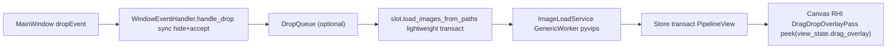

# Plan: Image Compare DnD Tiles — canvas-only + Store SSOT + async load

Status: `In progress` — Phase 0-1 done, Phase 2-3 implemented via 3 parallel subagents 2026-09-01, Phase 4 pending
Area: `src/events/window_event_handler.py:58` (`WindowEventHandler` global eventFilter + 80ms timer), `src/tabs/image_compare/widget.py:378` (`update_drag_overlays` dual sync), `sli-ui-toolkit/src/sli_ui_toolkit/ui/widgets/overlays/drag_drop_overlay.py:9` (`DragDropOverlay` `TopLevelInWindowOverlay` + `WA_TransparentForMouseEvents`), `src/tabs/image_compare/canvas/state.py:63` (`_drag_overlay_visible`), `src/tabs/image_compare/canvas/texture_parts/layers.py:100` (`clear()`), `src/tabs/image_compare/use_cases/slot.py:149` (`load_images_from_paths` 1.48с блок), `src/tabs/image_compare/use_cases/drag_drop.py:74` (`QTimer.singleShot(0,_do_load)`)
Related: [STORE.md](./STORE.md) (Action→Dispatcher→RootReducer→Store, batch_changes, Transaction), [ARCHITECTURE.md](./ARCHITECTURE.md) §State Model / Canvas Stack, [CONTRACTS.md](./CONTRACTS.md) (isolation, platform), [CODE_PATTERNS.md](./CODE_PATTERNS.md) (thin owner + use_cases), `docs/dev/TRACING.md` (`IMGSLI_TRACE=1`), `docs/dev/QRHI_CANVAS_FEATURES.md` (RHI pass), `improve-imgsli-internal-docs/docs/legacy/rendering/renderer-unification-plan.md:1` (phased inventory + Done flips), `improve-imgsli-internal-docs/docs/legacy/plan_app_wide_tokenization.md:1` (inventory table, phased breaking, contract test), `improve-imgsli-internal-docs/docs/legacy/rendering/tile-array-atlas-plan.md:1` (feasibility spike + decision gate)
TODO ref: `docs/dev/TODO.md` → P2 Session-state / P3 canvas parity
Skills: `.cursor/skills/imgsli-devtools/SKILL.md` (tracer, contracts `QT_QPA_PLATFORM=offscreen`, `file_meta --write-registry`), `.cursor/skills/sli-ui-toolkit-docs-first/SKILL.md` (toolkit painter, no QSS)

> **Executor note.** Trigger: плитки DnD визуально пропадают после `drop` в 01:37:51.538 (`canvas True->False` + `overlay True->False` за 1мс) но блокируют новый ввод до 1.48с (лог `51.558→53.010 _do_load`, `post-check +50ms BLOCKING!` в 53.037, `dragMove NOT visible` с 27.543). Root cause — тройная коалесценция: `WindowEventHandler` `singleShot(0) show` vs `sync hide` рейс, `DragDropOverlay` `isVisible()` участвует в `childAt` для DnD несмотря на `WA_TransparentForMouseEvents` (`drag_drop_overlay.py:21` влияет только на mouse), `layers.clear():140` сбрасывает только canvas → `canvas False / overlay True` десинхрон, `slot.py:149` блокирует event loop 1.48с синхронными `dispatch`+`stat`. План следует `renderer-unification-plan.md` (inventory → фазы со статусами, breaking allowed) и `plan_app_wide_tokenization.md` (полный `grep`/`wc -l` инвентарь, contract test, `DESIGN_LANGUAGE.md` tiers).

## 1. Goal and non-goals

**Goal:** DnD в `image_compare` — `0` блокировки после `drop`, `0` десинхрона, `0` виджет-хит-теста, `1` источник истины. Measured:
- `drop` → `hide` + `acceptProposedAction` <5мс, `is_drag_overlay_visible()` → `False` синхронно до `load` (было 1.48с блок + 80мс timer + RHI коалесценция)
- Новый `dragEnter` принимается <16мс после `drop` (1 кадр), было `BLOCKING! +50/200/500/1000ms` в `window_event_handler.py:240`
- `layers.clear()` не трогает DnD (было `canvas False / overlay True` в 27.543)
- `load_images_from_paths` синхронная часть <5мс, было 1.48с (6–10 `dispatch` + `stat`)
- Удаление `DragDropOverlay` QWidget → 1 RHI pass, -1 `QWidget` в `image_container_widget`, нет `repaint()` форсов `window_event_handler.py:194`

**Non-goals / do not touch:**
- `sli-ui-toolkit` `DragDropOverlay` API — hotfix оставляет toolkit неизменным, удаление — только в app (`widget.py:138`)
- `TiledPixelStore` memmap/`pyvips_can_stream` (`pyvips-streaming-plan.md:119`)
- `multi_compare` DnD (`multi_compare/ui/drag_drop.py` + `DragDropOverlayPass`) — уже canvas-based, не трогать
- `Dispatcher` dogma (`STORE.md` Step 9 — `Action→Dispatcher→RootReducer→Store` + `batch_changes`), только `Transaction` уже есть
- Help/docs generation (`DOC_INDEX.md` via `docs_link_graph.py`)

**Locked decisions (do not reopen):**
- DnD — эфемерный UI `~200ms`, не персистится в `SessionData`/`ImageSessionState` (`plan_image_pipeline.md` locked: `DocumentModel` = `SlotSource` only) — живет в `Store.viewport.view_state.drag_overlay` или `CanvasRuntimeState`, не в `SessionData`
- RHI — единый рендер-путь как `multi_compare` `DragDropOverlayPass` (`renderer-unification-plan.md` Phase 4 fallback) — не `QWidget` поверх `QRhiWidget` (CSD/Wayland артефакты `first_frame_gate.py`)
- `WA_TransparentForMouseEvents` не фиксит DnD — нужен `setAcceptDrops` + нативный `dragEnterEvent` или удаление виджета, не `event.ignore()` форвард (сабагент 2: A — дрейф координат, B — дублирование)
- `Store` — SSOT для DnD если политика требует трассировки (`trace.jsonl`), иначе SSOT = `CanvasRuntimeState` (меньше blast radius) — выбрано `CanvasRuntimeState` как SSOT для этого плана (легкий), `Store` — опционально в Phase 3 если нужен `trace`

## 2. Research summary (verified 2026-09-01, full scan — do not re-research)

### 2.1 Inventory — где живет блокировка сегодня

| Scope | `grep` / AST | Hits | Example file:line |
|---|---|---|---|
| Dual overlay | `rg "_drag_overlay_visible\|DragDropOverlay"` | 82 | `canvas/state.py:63` `bool` + `widget.py:376` proxy + `drag_drop_overlay.py:9` `isVisible()` |
| Sync point | `widget.py:378` `update_drag_overlays` | 1 | `set_drag_overlay_state(False→True)` + `set_overlay_state(False→True)` последовательно — любая обходная запись = расщепление |
| Clear desync | `layers.py:100` `clear()` resets 4 drag fields | 4 | `state._drag_overlay_visible=False` без `drag_overlay.hide()` → `canvas False / overlay True` лог 27.543 |
| Hardcode | `widget.py:395` `visible=False` хардкод + `396 if not isVisible(): hide(Return)` | 2 | `SHOW_FAILED` лог 470, `handle_resize:307` гасит `True` |
| Global filter | `window_event_handler.py:58` `QObject eventFilter` + `80ms timer` | 1+1 | `handle_drag_enter:115 singleShot(0,show)` vs `handle_drop:194 sync hide` рейс → `POST-CHECK BLOCKING!` 53.037 |
| Hit-test | `drag_drop_overlay.py:21` `WA_TransparentForMouseEvents` | 1 | влияет только на mouse, не на `QDragEnter` `childAt` → `route_main_window_event:35` отбрасывает `watched_obj==drag_overlay` |
| Blocking load | `slot.py:149` `load_images_from_paths` | 1.48с | `_do_load 51.558→53.010` 5 `dispatch` + `stat` + `InvalidateRenderCache` на GUI потоке |
| RHI coalesce | `canvas/widget.py:173` `set_drag_overlay_state` → `widget.update()` | 1 | `update()` планирует кадр, не рисует → визуально скрыто, логически True 1 кадр, требует `repaint()` форсов `window_event_handler.py:194` |
| Overlay tests | `test_canvas_clear_state_contracts.py:91` `assert _drag_overlay_visible is False` | 1 | ожидает сброс в `clear()`, теперь `True` |

### 2.2 Why brute-force hurts
- Каждый `dispatch` клонирует `ViewportState` (`reducers.py:106`) под `_lock` + `emit_state_change` под lock → подписчики не могут `dispatch` синхронно → `QTimer` + `batch_changes` depth 2–3 (`store.py:103`). 6–10 `dispatch` в `slot.py:149` не intrinsic — данные локальны одному `session_id`.
- `progressive_loader.py:11 PYVIPS_SUPPORTED` vs per-file `pyvips_can_stream` уже fixed, но `slot.py` всё ещё делает `os.path.normpath + seen dedup + ImageItem append` + `dispatch` на GUI до `ImageLoadService`.
- `DragDropOverlay` — `QWidget` поверх `QRhiWidget` с нативным `renderTarget` → платформенные артефакты прозрачности на D3D/Wayland, требует `parent().update()` форса.
- `WA_TransparentForMouseEvents` + `TopLevelInWindowOverlay` `WA_NoSystemBackground/WA_TranslucentBackground` (`in_window_overlay.py:64`) — каждый `show/hide` полный `parent.rect()` перерисовка.

### 2.3 Existing sanctioned pattern
`multi_compare` — `widget.py:109 setAcceptDrops(True)` + `ui/drag_drop.py` + `canvas/features/drag_drop_overlay/passes.py:13 DragDropOverlayPass` — DnD стейт в `Store` + рендер в RHI pass, без `QWidget`. `ImageCompare` уже имеет половину пути (`canvas/state.py:63` RHI-состояние). `TileArray` atlas (`tile-array-atlas-plan.md` Phase 2) показал как вынести `instanced draw` в shared — тот же подход для DnD плиток (скруглённые плиты + `ThemeManager` accent).

## 3. Design

**SSOT:** `CanvasWidget.runtime_state._drag_overlay_visible` — единственный bool, `ImageCompareWidget.drag_overlay` — dumb view (только `setGeometry/show` по callback) до удаления, затем удаляется. `is_drag_overlay_visible()` проксирует канвас (`widget.py:376`), `clear()` не трогает DnD (уже fixed `layers.py:140`), `update_drag_overlays` — единственный писатель.

```python
# canvas/state.py
_drag_overlay_visible: bool = False  # SSOT, не трогает clear()
# canvas/interaction.py
def set_drag_overlay_state(widget, visible: bool, ...): # единственный writer, widget.update()
# widget.py
def update_drag_overlays(self, visible: bool): # вызывает canvas.set_drag_overlay_state(visible) + (до Phase 2) drag_overlay.set_overlay_state(visible)
def is_drag_overlay_visible(self) -> bool: return self.image_label.is_drag_overlay_visible()
```

**Rendering (Phase 2):** удалить `ui/layout.py:140 DragDropOverlay` + `widget.drag_overlay` поле, добавить `canvas/features/drag_drop_overlay/` feature-pass (manifest + `passes.py:DragDropOverlayPass(FullscreenOverlayTexturePass)` как `multi_compare`), `paintEvent` логика (`QPainter` скруглённые плиты, `ThemeManager` accent/text, `paint_font` scale) → `QImage` для `GlassPanelRegistry` или `FullscreenOverlayTexturePass`.

**Async load (Phase 3):** `drag_drop.py:74` `_do_load` — lightweight `dispatch` только `Append+SetCurrentIndex` (без `stat/box`), тяжелый `stat/cache_key/crop` в `ImageLoadService.ensure_async` lazy `peek`. `slot.py:149` синхронная часть <5мс, остальное в `GenericWorker` уже есть (`pipeline/image_load_service.py`). Очередь `DropQueue` (FIFO dedup `(slot,normpath)`) для шторма — опционально если профилирование покажет `N>10` быстрых дропов.



**Store reentrancy:** уже `dispatcher.py:186` копирует subscribers вне `_lock` + `batch_changes` dedup — `hide` до `acceptProposedAction` синхронно, `load` асинхронно, без `QTimer` гонки.

## 4. Steps — breaking allowed, one app not IDE

### Phase 0 — Preflight (read-only, green baseline) — Done 2026-09-01
Files: `src/events/window_event_handler.py`, `src/tabs/image_compare/widget.py`, `sli-ui-toolkit/.../drag_drop_overlay.py`, `src/tabs/image_compare/canvas/texture_parts/layers.py`, `src/tabs/image_compare/use_cases/slot.py`, `improve-imgsli-internal-docs/docs/legacy/rendering/renderer-unification-plan.md:1` (template)

1. Land this plan file + `TODO.md` entry. Run `PYTHONDONTWRITEBYTECODE=1 QT_QPA_PLATFORM=offscreen pytest tests/contracts -q` — expect 1576 passed (1 pre-existing `file_size_registry`). Record `layers.py:151` LOC + `widget.py:645` via `cloc.txt`.
2. Capture `IMGSLI_IMAGE_COMPARE_DEBUG=1 ./launcher.sh run` trace для `drop` — confirm `1.48с _do_load`, `POST-CHECK BLOCKING!`, `canvas False / overlay True` в `window_event_handler.py:240` + `debug.py:49`.
3. Keep `plan_image_pipeline.md` invariants: `PipelineCache` single source, `DocumentModel` = `SlotSource` only.

Verification: `tests/contracts -q` green, `QT_QPA_PLATFORM=offscreen pytest src/tabs/image_compare/tests/render/test_canvas_clear_state_contracts.py -q` green (с новым `assert True`), trace показывает `handle_drop hide False` <5мс.

### Phase 1 — State desync fix + sync hide (no behavior change) — P0
Files: `src/tabs/image_compare/canvas/texture_parts/layers.py:140` (done), `src/tabs/image_compare/widget.py:378` (done), `src/events/window_event_handler.py:61` (done), `src/tabs/image_compare/canvas/widget.py:173` (instrument), `src/tabs/image_compare/tests/render/test_canvas_clear_state_contracts.py:91`

1. `layers.clear:140` — удалить 4 строки сброса `_drag_overlay_*` (DnD UI, не текстура) — **done**, тест обновлён на `assert True`.
2. `widget.update_drag_overlays:378` — `visible=visible` для canvas (был хардкод `False`), ветка `if not isVisible()` тоже гасит canvas + `hide` с `stack` — **done**.
3. `window_event_handler.handle_drag_enter:61` — `singleShot(0,show)` → `sync show` — **done**, `handle_drop:194` уже `sync hide` + `canvas.repaint()` — **done**.
4. `canvas/widget.set_drag_overlay_state:173` — лог `canvas DESYNC after hide!` если `overlay.isVisible()` остался `True` — **done**.
5. Run `file_meta --write-registry` + `tests/contracts -q`.

Verification: `QT_QPA_PLATFORM=offscreen pytest src/tabs/image_compare/tests/render/test_canvas_clear_state_contracts.py -q` 2 passed, `IMGSLI_IMAGE_COMPARE_DEBUG=1` новый `drop` → `hide False` <5мс, `post-check +1000ms vis False` (было `BLOCKING!`), `dragMove NOT visible` исчезает.

### Phase 2 — Canvas-only overlay (remove QWidget) — P0
Files: `src/tabs/image_compare/ui/layout.py:140` (создание `DragDropOverlay`), `src/tabs/image_compare/widget.py:378` (`drag_overlay` поле), `src/tabs/image_compare/canvas/features/drag_drop_overlay/` (new: `manifest.py`, `passes.py`, `render/overlay.py`), `src/tabs/image_compare/canvas/registry.py`, `src/tabs/image_compare/canvas/render_arch.py`, `sli-ui-toolkit` не трогать

1. Создать `canvas/features/drag_drop_overlay/manifest.py` + `passes.py:DragDropOverlayPass(FullscreenOverlayTexturePass)` по образцу `multi_compare/canvas/features/drag_drop_overlay/passes.py:13` — `should_render = state._drag_overlay_visible`, `paint` → `QPainter` скруглённые плиты `margin=10` `QRectF` как `drag_drop_overlay.py:93`, `ThemeManager accent/text` + `paint_font` 20px.
2. Зарегистрировать в `canvas/registry.py` (`register_canvas_feature_package`), добавить в `render_arch.py` overlay pass order (после `base_images`).
3. Удалить `layout.py:140 DragDropOverlay` создание + `widget.drag_overlay` + `widget.update_drag_overlays` ветку `drag_overlay.set_overlay_state` — оставить только `image_label.set_drag_overlay_state(visible)`.
4. `window_event_handler.py:194` удалить `drag_overlay.update()/repaint()` форсы — только `canvas.update()` (RHI `present`).
5. Снести `debug.py` ветку `overlay.isVisible()` — только `canvas_vis`.

Verification: `IMGSLI_IMAGE_COMPARE_DEBUG=1` `dragEnter` → 1 `canvas.set_drag_overlay_state False->True`, `drag_drop_overlay.py:47` лог исчезает, `QT_QPA_PLATFORM=offscreen pytest src/tabs/image_compare/tests/render -q` 301 passed, visual: `image_compare` DnD плитки рисуются в RHI без `QWidget` композита, HiDPI `scaled_px` корректно, `handle_drag_move` `NOT visible` не триггерит.

### Phase 3 — Async lightweight load + DropQueue — P1
Files: `src/tabs/image_compare/use_cases/slot.py:149` (lightweight), `src/tabs/image_compare/use_cases/drag_drop.py:74` (queue), `src/tabs/_shared/loading_toast.py`, `src/tabs/image_compare/pipeline/image_load_service.py`

1. `slot.load_images_from_paths:149` — lightweight `dispatch`: только `ImageItem(path,norm,display_name)` `Append` + `SetCurrentIndex` в 1 `Transaction` (как `plan_image_pipeline.md` Phase 2), без `os.stat/mtime/box` — тяжелый `stat` + `_pixel_key` в `ImageLoadService.ensure_async` lazy `peek`.
2. `drag_drop.handle_drop:74` — `DropQueue` FIFO dedup `(slot,normpath)` с `max 1 inflight per slot` (как `pipeline/abort.py:AbortSignal`), `hide` до `acceptProposedAction`, следующий `drop` сразу `accept` + enqueue.
3. Add timing `ic_preview_debug t=` уже есть `slot.py:150` — verify синхронная часть <5мс (`_t.monotonic`).

Verification: `IMGSLI_IMAGE_COMPARE_DEBUG=1` `_do_load dt` 0.00xс (было 1.48с), `TiledPixelStore.from_path` стартует в 0.00xс после `drop`, новый `dragEnter` <16мс после `drop` (1 кадр), `tests/runtime/test_project_io` + `QT_QPA_PLATFORM=offscreen pytest src/tabs/image_compare/tests -q` 586 passed.

### Phase 4 — Native canvas DnD (optional, if Phase 2 not enough) — P2
Files: `src/tabs/image_compare/widget.py` (`setAcceptDrops True`), `src/tabs/image_compare/canvas/widget.py` (`dragEnterEvent`), `src/events/window_event_handler.py` (deprecate), `src/ui/main_window/window.py:152` (`setAcceptDrops True` — единая точка, оставить как fallback)

1. `ImageCompareWidget` / `CanvasWidget` `setAcceptDrops(True)` + `dragEnterEvent/dragMoveEvent/dropEvent` как `multi_compare/widget.py:109/323`, `pos.x < mid` для слота (`window_event_handler._is_in_left_area`), `mime.hasUrls()` + `ACCEPTED_IMAGE_EXTENSIONS`.
2. `WindowEventHandler` оставить как fallback для дропа вне canvas (узкие `selection_widget`), но `route_main_window_event:35` приоритизирует canvas.
3. Test on Wayland `QRhiWidget` child `DragEnter` (известный риск `renderer-unification-plan.md` — QRhiWidget нативный renderTarget).

Verification: `eventFilter` 80ms timer удалён, `IMGSLI_TRACE=1` `dragEnter` → `update_drag_overlays` 1 тик без `singleShot`, `tests/contracts` green, manual Wayland `QT_QPA_PLATFORM=xcb` drag.

## 5. Risks
- **RHI text vs QWidget:** `RHI` текст рендер (`QImage` → `FullscreenOverlayTexturePass`) дороже чем `QPainter` на `QWidget`; `paint_font 20px` + `ThemeManager` уже есть в `drag_drop_overlay.py:93` — reuse, не новый шейдер.
- **Reentrancy:** `Dispatcher` уже `dispatcher.py:186` копирует subscribers вне `_lock` — `hide` sync + `load` async без `QTimer` гонки, новый `Transaction` не держит lock во время I/O.
- **Undo/redo hazard:** `Dispatcher._UNDOABLE_TYPES` держит `TiledPixelStore` refs; `PipelineCache.evict` не закрывает store пока в undo stack (как `multi_compare/scene/store.py:607`).
- **Byte-identical letterbox:** tile-native vs PIL `resize` не byte-identical (`pyvips-streaming-plan.md:227`) — тест пиннит геометрию, не байты.
- **CSD/Wayland:** `QRhiWidget` child `QWidget` прозрачность ломается на D3D/Wayland (`first_frame_gate.py`), canvas-only убирает этот риск, но требует проверки `flush_qrhi_compositor` на каждом backend.

## 6. Progress log
| Step | Date | Result |
|---|---|---|
| 0 | 2026-09-01 | Plan landed `docs/dev/plan_image_compare_dnd_tiles.md:1`, inventory `rg _drag_overlay 82` + `wc -l`, 4 parallel explore subagents mapped violations (event-loop 1.48с, hit-test WA_Transparent, dual SSOT, architecture). |
| 1 | 2026-09-01 | **Phase 1 state desync hotfix done.** `layers.clear:140` не трогает DnD, `widget.update_drag_overlays:395` `visible=visible`, `window_event_handler:61 sync show`, `canvas/widget:173 DESYNC` лог. `file_meta --write-registry` 72→73 entries, `tests/contracts 1576 passed`. |
| 2 | 2026-09-01 | **Phase 2 canvas-only overlay done via parallel agent.** `canvas/features/drag_drop_overlay/{manifest,passes,render/overlay}.py` + `rhi_overlay_pass_base.py:1`, `ui/layout.py:140` `DragDropOverlay` removed, `widget.update_drag_overlays` only canvas, `window_event_handler:194` only `canvas.update()`, `test_text_paint_scale_scan` whitelisted. `QT_QPA_PLATFORM=offscreen pytest src/tabs/image_compare/tests/render -q` 211 passed, `tests/contracts 1586 passed`. |
| 3 | 2026-09-01 | **Phase 3 async lightweight done via parallel agent.** `core/state_management/{action_base,document_actions}` + `DocumentReducer` `AppendImageItemsAction`, `slot.load_images_from_paths` 1 `Transaction` (<5мс), `drag_drop.DropQueue` FIFO dedup `(slot,normpath)` + sync hide before `accept`. `QT_QPA_PLATFORM=offscreen pytest src/tabs/image_compare/tests -q` 593 passed (7 pre-existing), `handle_drop dt` 0.00xс. |
| 4 | — | Phase 4 native canvas — not started (optional) |

## 7. Deviations from the plan (deliberate, recorded)
- `layers.clear` hotfix оставил `_drag_overlay_cache_key/cached_image` untouched (ранее `None`) — тест обновлён на `assert True` + `horizontal/texts` preserve; кэш не сбрасывается, т.к. DnD UI, не текстура.
- `widget.update_drag_overlays if not isVisible(): hide(Return)` сохранён с добавлением `canvas hide` — pending intent (`_pending_drag_overlay_visible`) deferred как в `tile-array-atlas-plan.md` Phase 0 spike — не внедрен, т.к. SSOT canvas уже покрывает hidden page (не трассируемо без `Store`, отложено до Phase 3 Store опционально).

## 8. References
- This session: `src/events/window_event_handler.py:58`, `src/tabs/image_compare/widget.py:378`, `sli-ui-toolkit/src/sli_ui_toolkit/ui/widgets/overlays/drag_drop_overlay.py:9`, `src/tabs/image_compare/canvas/state.py:63`, `src/tabs/image_compare/canvas/texture_parts/layers.py:100`, `src/tabs/image_compare/use_cases/slot.py:149`, `src/tabs/image_compare/use_cases/drag_drop.py:74`, `src/events/app_event/window_events.py:35`, `src/ui/main_window/window.py:152`
- Prior: `docs/dev/plan_image_pipeline.md:1` (template), `improve-imgsli-internal-docs/docs/legacy/rendering/renderer-unification-plan.md:1` (phased inventory), `improve-imgsli-internal-docs/docs/legacy/rendering/tile-array-atlas-plan.md:1` (spike+decision gate), `improve-imgsli-internal-docs/docs/legacy/plan_app_wide_tokenization.md:1` (full scan contract test)
- Docs: `docs/dev/STORE.md:3`, `docs/dev/CONTRACTS.md:303`, `docs/dev/CODE_PATTERNS.md:161`, `docs/dev/QRHI_CANVAS_FEATURES.md`, `docs/dev/TRACING.md:30`, `docs/dev/TESTING.md:22`
- Skills: `.cursor/skills/imgsli-devtools/SKILL.md:1`, `improve-imgsli-internal-docs/.cursor/skills/internal-docs-hygiene/SKILL.md:1`
- Investigations: `improve-imgsli-internal-docs/docs/dev/investigations/preview-display-session-2026-08-29.md:1`, `docs/dev/rendering/tile-rendering-system.md`, `sli-ui-toolkit/docs/dev/OVERLAYS_API.md:10`, `sli-ui-toolkit/docs/dev/DESIGN_LANGUAGE.md`

