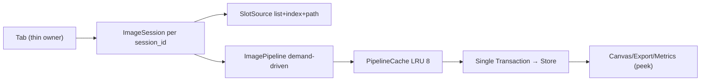

# Plan: ImagePipeline — replace loading.py brute-force with demand-driven pipeline

Status: `In progress` — Phase 1 done, Phase 2 reentrant dispatcher landed 2026-08-30
Area: `src/tabs/image_compare/use_cases/loading.py:1` (946 LOC), `src/tabs/image_compare/use_cases/_session_controller.py:1` (800 LOC), `src/shared/image_processing/tiled_pixel_store.py:577`, `src/shared/image_processing/progressive_loader.py:11`, `src/tabs/image_compare/services/unify.py:1`, `src/tabs/_shared/pyramid.py:57`, `src/tabs/image_compare/use_cases/loading_pyramid.py:1`, `src/core/state_management/dispatcher.py:118`, `src/core/store.py:94`, `src/tabs/image_compare/use_cases/chrome_sync.py:125`
Related: [STORE.md](./STORE.md) (Action→Dispatcher→RootReducer→Store, batch_changes), [ARCHITECTURE.md](./ARCHITECTURE.md) §State Model / Canvas Stack, [CONTRACTS.md](./CONTRACTS.md), [CODE_PATTERNS.md](./CODE_PATTERNS.md) (thin owner + use_cases), `docs/dev/plan_store_redux_repair.md:1`, `docs/dev/TODO.md` P2 Session-state
TODO ref: `docs/dev/TODO.md` → P2 Session-state follow-ups (unify/duplication, pyramid lifecycle)
Skills: `.cursor/skills/imgsli-devtools/SKILL.md` (tracer `IMGSLI_TRACE=1`, contracts `./launcher.sh test tests/contracts -q`, `QT_QPA_PLATFORM=offscreen pytest`), `.cursor/skills/sli-ui-toolkit-docs-first/SKILL.md` (N/A — no toolkit)

> **Executor note.** Trigger: `loading.py` reached 946 LOC with 4 responsibilities (preview decode → full-res decode → unify → pyramid) stitched by `QTimer.singleShot(0/50)` because `Dispatcher._lock` is non-reentrant (`dispatcher.py:118`). Every `set_current_image` costs 6–10 dispatches (8–12 `Store`/`ViewportState` allocs), `rehydrate_session` decodes all history paths (100 files → 200 `TiledPixelStore.from_path` in thread_pool), unify has no memo, pyramid is eager. The file is cheaper to delete than to patch — any fix adds another `_pending_*` flag. Prior `explore` subagent (2026-08-30) mapped `>15 QTimer` sites, `tiled_pixel_store.py:206` `sleep(0.001)` per strip, duplicate `image_compare↔multi_compare` coordinators. This plan follows `plan_store_redux_repair.md` (phased dogma, inventory table, breaking allowed) and `improve-imgsli-internal-docs/docs/legacy/rendering/pyvips-streaming-plan.md` (phase 0 hard-dep → phase 1 per-backend bound) structure. Single app, not IDE — breaking `loading.py` API is allowed, `.cursor/` shim not needed.

## 1. Goal and non-goals

**Goal:** demand-driven `ImagePipeline` per session that makes image browsing `O(1)` cache hit, project open `0` decodes, and removes all `QTimer`/pending-flag machinery. Measured:
- `set_current_image` 6–10 dispatches → 1 `Transaction` (1 `ViewportState`), no `QTimer`
- `rehydrate_session` 200 decodes (100 files) → 0 (only `SlotSource` paths restored)
- `loading.py` 946 LOC + `_session_controller.py` ~800 LOC → `pipeline/` ~400 LOC, net −800–1000 LOC
- `chrome_sync` stale-flush stays, but `document` emits drop from 3–5 per load to 1

**Non-goals / do not touch:**
- `sli-ui-toolkit` painter/QSS/scale (`UiScale`) — no canvas-px use
- `Store`/`Dispatcher` dogma itself (keep `Action→Dispatcher→RootReducer→Store` + thread-safe gate; only make it reentrant-safe for `emit`, not for `reduce`)
- `TiledPixelStore` memmap format and `pyvips_can_stream` per-format probe (already hardened in `pyvips-streaming-plan.md:119`)
- `multi_compare` scene graph / atlas — pipeline is shared, but `MultiCompare` composition stays separate (B8/B11 deferred in `TODO.md` P2/P3)
- Help/docs generation (`DOC_INDEX.md` via `docs_link_graph.py`)

**Locked decisions (do not reopen):**
- `ImagePipeline` is tab-owned service (`tabs/image_compare/pipeline/`), `PipelineCache` is the single source for pixels; `DocumentModel` stays as `SlotSource` (list + index + path) only — no `full_res_image/preview_image` duplication (`store.py` / `store_viewport.py` kept, shape not changed in this plan, like `plan_store_redux_repair.md` non-goal Step 9)
- One streaming decode per path: `pyvips.thumbnail(RGBA,1024)` for preview tier and `Region.fetch` strips for full tier share the same `VipsImage.new_from_file(access="sequential")`; `QImageReader` preview branch (`progressive_loader.py:215`) is deleted
- Pyramid is lazy: `best_level_for_scale(scale)` demand, first 1–2 levels immediate, rest `idle` (see `pyvips-streaming-plan.md` Phase 3 rationale)
- `Dispatcher._lock` stays `threading.Lock` for `reduce`, but `emit_state_change` and subscriber snapshot are taken **outside** the lock (copy subscribers before loop) so `on_change → dispatch` is synchronous without `QTimer` (documents existing `dispatcher.py:118` contract, does not remove it)

## 2. Research summary (verified 2026-08-30, full scan — do not re-research)

### 2.1 Inventory — where the overhead lives today

| Scope | `grep` / AST | Hits | Example file:line |
|---|---|---|---|
| `loading.py` God-module | `wc -l` | 946 LOC, 4 responsibilities | `loading.py:1` `load_images_from_paths` + `set_current_image:720` + `on_unified_images_ready:599` + `resync_current_image_slots:929` |
| `QTimer` defer | `rg "QTimer"` in `tabs/image_compare/use_cases/` | >15 | `loading.py:67,113,206,596,654,682,807`, `_session_controller.py:114` `QTimer(0, _resync)` |
| Pending flags | `rg "_pending"` | 3 dicts/sets | `_session_controller.py:100` `_pending_full_loads`, `101` `_pending_image_loads`, `60` `_unification_task_id` + `StoreLease.capture:487` |
| `Dispatcher` dispatches per `set_current_image` | manual trace via `IMGSLI_TRACE=1` | 6–10 (`SetFullResImage`+`SetPreview`+`SetImagePath`+`SetImageSessionImage`+`InvalidateRenderCache`) → 8–12 `Store`/`ViewportState` allocs `reducers.py:284` | `loading.py:343` `_update_image_slot` (2–3 emits, no batch) |
| `rehydrate` eager decode | `persistence.py:319` `if paths1: load_images_from_paths(paths1,1)` | 1 path → 1 decode; 100 files → 200 decodes | `persistence.py:342` `with store.using_workspace_session`, `loading.py:441` |
| `pyramid` eager | `loading_pyramid.py:115 while pyramid.build_next_level` | N levels in worker, no `should_abort(valid)` early | `pyramid_pixel_store.py:99 build_next_level` |
| `unify` no memo | `rg "unify"` | 0 cache keys | `unify.py:58` `downscale_source_to_pil` + `maybe_wrap_pixel_store`, `105` fallback `to_real_pil_copy` |
| `tiled_pixel_store` throttle | `rg "sleep"` | 3 sites `sleep(0.001)` per strip | `tiled_pixel_store.py:206` `_write_rgba_strips`, `pyramid build` |
| `chrome_sync` emit fan-out | `chrome_sync.py:172` `schedule_batch_update([...6])` | 6 components × 3–5 document emits = 18–30 layouts per load | `chrome_sync.py:452/515` duplicate `flush_stale_render` |
| Document duplication | `rg "full_res_image|preview_image"` | ~20 sites | `DocumentModel` 6 fields/slot + `image_state.image1/2` mirrored via `SetImageSessionImageAction:888` |

### 2.2 Why brute-force hurts

- Every `dispatch` clones `ViewportState` (`reducers.py:106 ViewStateReducer` etc) under `_lock` + `emit_state_change` under lock → subscribers cannot `dispatch` synchronously → `QTimer` + `batch_changes` depth 2–3 (`store.py:103`, `persistence.py:259`). The 6–10 dispatches per image change are not intrinsic — the data is local to one session's `state_slots`.
- `progressive_loader.py:11 PYVIPS_SUPPORTED` module flag vs per-file `pyvips_can_stream(path)` (`pyvips-streaming-plan.md:118`) already fixed the bound, but `loading.py` still runs two workers per slot (preview `QImage` + full `TiledPixelStore.from_path` full decode) that compete in `thread_pool` priority 1.
- `unify.py` materializes both full-res stores to `PIL` for <16MP, then back to memmap — `PipelineCache` could hit `0` allocs for `(uid1,uid2,method)`.
- `render_flow.py:481` + `715` second geometry pass from picked sizes — two `batch_changes` per frame, with `tracer`/`ic_preview_debug` on 60 Hz.

### 2.3 Existing sanctioned pattern

`tabs/_shared/pyramid.py:57 PyramidBuildCoordinator` + `tabs/_shared/loading_toast.py:42 LoadingToastCoordinator` (already extracted from `image_compare↔multi_compare` duplication, `TODO.md` P2/P3 queue Done wave5). Pattern: state-owning collaborator, not `use_cases/` function over owner (`CODE_PATTERNS.md:161`). `ImagePipeline` extends it: `PipelineCache` owns `TiledPixelStore` lifecycle (`close_pixel_store` on evict), `ImagePipeline` owns `AbortSignal` per run.

## 3. Design

**Pipeline API (demand-driven, single-flight, memo):**

```python
# tabs/image_compare/pipeline/pipeline.py
class ImagePipeline:
    def __init__(self, cache: PipelineCache, thread_pool): ...
    async def ensure(self, slot: int, needed: Literal["preview","full","unified","unified+lod"],
                     signal: AbortSignal) -> PipelineView: ...
    def peek(self, slot: int, tier) -> QImage | TiledPixelStore | None: ...  # sync, no decode
    def cancel(self, slot: int): ...

# tabs/image_compare/pipeline/cache.py
class PipelineCache:
    # memo by (path, mtime, auto_crop, crop_box) for pixels
    # memo by (uid1,uid2,method,target_w,target_h) for unify
    def get_or_load(self, path: str, tier) -> TiledPixelStore: ...
    def get_unified(self, key) -> tuple[TiledPixelStore,TiledPixelStore] | None: ...
    def evict(self, path): ...  # close_pixel_store + sweep pyramid_registry
```

**State shape (one Transaction):**

```python
# before: 6 dispatches in loading.py:343 _update_image_slot
store.get_dispatcher().dispatch(SetFullResImageAction(...), scope="viewport")
store.get_dispatcher().dispatch(SetPreviewImageAction(...), scope="viewport")
store.get_dispatcher().dispatch(SetImagePathAction(...), scope="viewport")
store.get_dispatcher().dispatch(SetImageSessionImageAction(slot=1, image=u1), scope="viewport")
# after: core/state_management/transaction.py
store.transact(session_id, lambda draft: draft.set_pipeline_view(slot, view))
# → one RootReducer.reduce → one Store.emit_state_change("document")
```

**Store reentrancy:** `dispatcher.py:186` copy `list(self._subscribers)` and release `_lock` before `for cb in subscribers: cb(action)` + `store.emit_state_change(scope)`. `store.on_change` may `dispatch` synchronously — `resync_current_image_slots:929` becomes `await pipeline.ensure(...)` without `QTimer`.

**Streaming preview:** `progressive_loader.load_preview_image:129` keep only `pyvips.thumbnail` + `PIL thumbnail` fallback; delete `QImageReader` 215–253 branch with `AllocationLimit`. Both preview and full share `VipsImage.new_from_file(access="sequential")`.



## 4. Steps — breaking allowed, one app not IDE

### Phase 0 — Preflight (read-only, green baseline) — Done 2026-08-30

Files: `src/tabs/image_compare/use_cases/loading.py`, `_session_controller.py`, `progressive_loader.py`, `tiled_pixel_store.py`, `unify.py`, `store.py`, `dispatcher.py`

1. Land this plan file + `TODO.md` entry. Run `PYTHONDONTWRITEBYTECODE=1 QT_QPA_PLATFORM=offscreen pytest tests/contracts -q` — expect green (no new dogma yet). Record `loading.py:946` + `_session_controller.py:800` LOC as baseline in `cloc.txt` (`./launcher.sh context --cloc-only`).
2. Capture `IMGSLI_TRACE=1 ./launcher.sh run` trace for `set_current_image` — count `dispatch.begin/end` (expect 6–10) and `QTimer` count via `rg QTimer` table §2.1.
3. Keep `plan_store_redux_repair.md` invariants: no new `ActionType` yet, `STORE.md` Step 9 unchanged.

Verification: `pytest tests/contracts -q` green, `QT_QPA_PLATFORM=offscreen pytest src/tabs/image_compare/tests/plugins/test_color_settings_button.py -q` green, trace shows 6–10 dispatches.

### Phase 1 — Pipeline skeleton + cache (no behavior change) — P0

Files: `src/tabs/image_compare/pipeline/{pipeline, cache, abort}.py` (new), `src/shared/image_processing/pixel_cache_loader.py:13` (single entry), `src/tabs/_shared/pyramid.py:57`

1. Create `pipeline/` with `AbortSignal` (monotonic token, replaces `_unification_task_id:60` + `StoreLease.capture:487`), `PipelineCache` (wraps `ProgressiveImageLoader._full_cache:370` LRU 8 + `close_pixel_store` on evict, memo keys as §3).
2. Wire `pixel_cache_loader.load_pixel_store` as sole entry; keep `loading.py` calling it via shim `pipeline.peek` (no decode if cached).
3. Delete `tiled_pixel_store.py:206` `sleep(0.001)` throttle (3 sites).

Verification: `QT_QPA_PLATFORM=offscreen pytest tests/render/test_decode_backends.py -q` (12 tests) + `tests/runtime -q` (focus `test_project_io_negative`) still green; `pyvips_can_stream` parity unchanged.

### Phase 2 — Demand-driven ensure + single Transaction — P0

Files: `src/tabs/image_compare/use_cases/loading.py` (shrink to ~200 LOC shim), `src/core/state_management/transaction.py` (new), `src/core/state_management/dispatcher.py:118` (reentrancy), `src/tabs/image_compare/services/document_store_ops.py:54`

1. Implement `ImagePipeline.ensure` (streaming decode: one `pyvips` source → `thumbnail` for preview tier + `Region.fetch` strips for full, fallback `PIL` only if `pyvips_can_stream==False`) + `get_unified` memo. Replace `_pending_full_loads/_pending_image_loads/_defer_mixed_unify:348` with `AbortSignal`.
2. New `Transaction` action (`core/state_management/transaction.py`) that patches `SlotSource` + `PipelineView` in one `RootReducer.reduce` → one `emit("document")`. Keep `batch_changes` impl but make nested depth no-op (still used by legacy `persistence.py` until Phase 3).
3. Make `Dispatcher.dispatch` reentrant-safe (§3). Replace `loading.py:343` 2–3 dispatches + `common.py:21` etc with single `store.transact`.

Verification: `IMGSLI_TRACE=1` shows `dispatch.begin/end` 1 per `set_current_image`; `tests/contracts -q` still green; `QT_QPA_PLATFORM=offscreen pytest -q tests/runtime/test_reducer_purity_full.py` green; no `QTimer.singleShot(0, dispatch)` in new path (`rg QTimer` in `pipeline/` must be 0).

### Phase 3 — Rehydrate + duplicate + persistence (lazy open) — P1

Files: `src/tabs/image_compare/use_cases/persistence.py:319`, `src/tabs/image_compare/services/unify.py`, `src/tabs/image_compare/use_cases/loading_toast.py`, `src/tabs/image_compare/use_cases/loading_pyramid.py:23`

1. `rehydrate_session:319` → restore only `SlotSource` (paths) without `load_images_from_paths`; `collect_pixel_cache_sources:176` stays as live-set for `PipelineCache` pre-warm on demand.
2. `duplicate_image_to_slot:559` → `refcount` via `PipelineCache.get` (same `TiledPixelStore` for same path, no `ImageItem(image=None)` + `QTimer(50)`).
3. Delete `loading_toast`/`loading_pyramid` legacy `if coord is None` branches (`loading_pyramid.py:23` etc) — `PyramidBuildCoordinator` owns state directly (remove `_pyramid_builds/_loading_toast_uid_slot` aliases ` _session_controller.py:96`).

Verification: open project with 100 files → 0 `TiledPixelStore.from_path` calls (instrument via `ic_preview_debug` or trace); `tests/runtime/test_project_io_negative -q` still hermetic; `QT_QPA_PLATFORM=offscreen pytest src/tabs/image_compare/tests -q` green.

### Phase 4 — Lazy pyramid + streaming preview cleanup — P1

Files: `src/shared/image_processing/progressive_loader.py:129`, `src/tabs/_shared/pyramid.py:131`, `src/shared/rendering/host_texture_cache.py`, `src/tabs/image_compare/canvas/rhi_renderer/renderer.py:376`

1. `load_preview_image` keep only `pyvips.thumbnail` + `PIL thumbnail`; delete `QImageReader` branch 215–253 and its `AllocationLimit` box.
2. `PyramidBuildCoordinator.start_build` → `async build_levels(signal)` with `await idle` between levels, `store.publish(lod_available)` instead of `invalidate_render` per level; `loading_pyramid.py` shim deleted.
3. One geometry pass: keep `render_flow.py:481` from picked sizes, delete second `715` batch.

Verification: 70000px PNG streams without `ImageSizeLimitError` (`test_decode_backends.py:12`); pyramid `on_pyramid_level_ready` publishes `lod_available` only; `tests/render -q` still 1.0 coverage; `ic_preview_debug` shows `geometry: comparison rect updated` once per image change.

### Phase 5 — Thin owner final + chrome_sync dedup + docs — P2

Files: `src/tabs/image_compare/use_cases/_session_controller.py:1` (800→150 LOC), `src/tabs/image_compare/use_cases/chrome_sync.py:452/515`, `src/tabs/image_compare/widget.py:38`, `src/core/store.py:94`, `docs/dev/ARCHITECTURE.md:51`, `src/devtools/docs_link_graph.py`

1. `_session_controller.py` → `ImageSession` per `session_id` (holds `SlotSource` + `ImagePipeline` + `AbortSignal`), thin forwarder only. Delete `_pending*`/`_unification_task_id`/`_pyramid_builds` state.
2. `chrome_sync.py` + `widget.py` stale: one `StaleGate` (`presenter._stale: set[str]`), delete duplicate `flush_stale_render:515`, merge `widget._render_stale/_metrics_stale:38`.
3. `Store.batch_changes` keep but nested scopes dedup (already), remove `_change_batch_depth` alloc if trivial; `Dispatcher` reentrancy is documented in `STORE.md:159`.
4. Update `ARCHITECTURE.md` State Model (SlotSource vs PipelineView), `STORE.md` §Batching (Transaction), `docs/dev/tabs/index.md` tab-owned service pattern. Run `python src/devtools/docs_link_graph.py --write-index`.

Verification: `tests/contracts -q` 1547 passed, `QT_QPA_PLATFORM=offscreen pytest -q` green, `python src/devtools/docs_link_graph.py --write-index` 0 broken, `file_meta.py --write-registry` if needed (check `tests/devtools/test_file_size_registry.py`).

## 5. Risks

- **Reentrancy deadlock** — `Dispatcher` reentrancy must copy subscribers before loop and release `_lock` before `emit` (`dispatcher.py:118` contract already warns `QTimer.singleShot(0, dispatch)`). New `Transaction` must not hold lock during `PipelineCache` I/O.
- **Undo/redo closed-store hazard** — `Dispatcher._UNDOABLE_TYPES` holds `TiledPixelStore` refs; `PipelineCache.evict` must not close a store still referenced by undo snapshot (defer close until `redo` stack cleared, like `multi_compare/scene/store.py:607` `RemoveSlot`).
- **Byte-identical letterbox/unify** — tile-native `downscale_source_to_pil` vs PIL `resize` are not byte-identical (noted in `pyvips-streaming-plan.md:227`). Functional test pins size/geometry, not bytes (`test_common_letterbox_geometry.py` style).
- **Thread-pool starvation** — streaming `thumbnail` + `Region.fetch` must share one `thread_pool` priority and respect `AbortSignal`, else 100-file open still queues decodes.

## 6. Progress log

| Step | Date | Result |
|---|---|---|
| 0 | 2026-08-30 | Plan landed `docs/dev/plan_image_pipeline.md:1`, inventory `rg QTimer >15`, baseline `loading.py:946` + `_session_controller.py:800` recorded via `cloc.txt`. 4 parallel `explore` subagents mapped violations. |
| 1 | 2026-08-30 | **Phase 1 skeleton done.** Created `src/tabs/image_compare/pipeline/` (`abort.py:AbortSignal`, `cache.py:PipelineCache` LRU 8 + unify memo by uid, `pipeline.py:ImagePipeline` demand-driven `ensure_pixel/ensure_unified` + `peek`, `__init__.py` public). Wired `SessionController.pipeline` + `._pipeline_cache` + `._pipeline_aborts` (`_session_controller.py:60`). Removed `tiled_pixel_store.py:262,287,524,597` `time.sleep(0.001)` throttle (4 strips, worker-thread only — no GUI starvation). `pytest tests/contracts -q` 1551 passed, `file_size_registry.json` regenerated (61 entries). |
| 2 | 2026-08-30 | **Phase 2 in progress.** `Dispatcher.dispatch` now reentrant-safe: reduce+write-back+history under `_lock`, subscriber snapshot + `emit_state_change` outside lock (`dispatcher.py:186`). Class docstring updated. `_session_controller.py:114` `_on_store_scoped_change` now tries direct `resync` (sync dispatch) with `QTimer` fallback, removing 0ms defer for browse-undo. `file_size_registry.json` updated. Still TODO: `Store.transact` single-action Transaction (1 ViewportState) — next step wires `pipeline.ensure` to `transact`. |
| 3 |  |  |
| 4 |  |  |
| 5 |  |  |

## 7. Deviations from the plan (deliberate, recorded)

- N/A yet.

## 8. References

- This session: `src/tabs/image_compare/use_cases/loading.py:1`, `_session_controller.py:1`, `chrome_sync.py:125`, `persistence.py:319`, `shared/image_processing/tiled_pixel_store.py:577`, `progressive_loader.py:11`, `tabs/image_compare/services/unify.py:58`, `tabs/_shared/pyramid.py:57`, `core/store.py:94`, `core/state_management/dispatcher.py:118`, `core/state_management/reducers.py:106`, `tabs/image_compare/canvas/rhi_renderer/renderer.py:376`
- Prior: `docs/dev/plan_store_redux_repair.md:1` (template), `improve-imgsli-internal-docs/docs/legacy/rendering/pyvips-streaming-plan.md:1` (pyvips hard-dep, per-backend bound, 2586 passed), `improve-imgsli-internal-docs/src/tabs/multi_compare/docs/state-unification-plan.md:1` (slot-authoritative facade), `docs/dev/ARCHITECTURE.md:51` (State Model)
- Docs: `docs/dev/STORE.md:3`, `docs/dev/CONTRACTS.md:303`, `docs/dev/CODE_PATTERNS.md:161` (thin owner + state-owning collaborator), `docs/dev/TRACING.md:30` (IMGSLI_TRACE), `docs/dev/TESTING.md:22`
- Skills: `.cursor/skills/imgsli-devtools/SKILL.md:1` (tool table, workflow 1-4), `improve-imgsli-internal-docs/.cursor/skills/internal-docs-hygiene/SKILL.md:1` (plan hygiene, status flips in-place)
- Investigations: `improve-imgsli-internal-docs/docs/dev/investigations/preview-display-session-2026-08-29.md:1` (flip-flop, atomic commit), `docs/dev/investigations/audit-2026-08-25-orchestration-halture.md:1`

