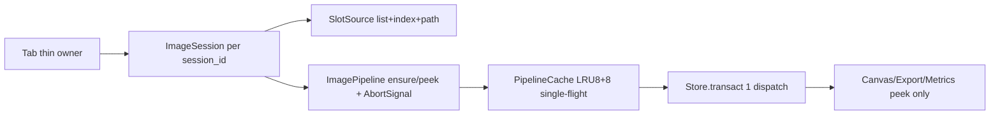

# Plan: Loading pipeline consolidation — 8 caches → 1, 8 cancels → 1

Status: `Open` — design approved, Phase 0 preflight next
Area: `src/tabs/image_compare/pipeline/cache.py:60` (`PipelineCache`), `src/shared/image_processing/progressive_loader.py:349` (`ProgressiveImageLoader._full_cache/_preview_cache`), `src/shared/image_processing/pixel_cache_registry.py:15`, `src/shared/image_processing/pyramid_registry.py:20`, `src/shared/image_processing/autocrop/service.py:27`, `src/tabs/image_compare/_session_controller.py:60,100,123` (`_unification_task_id`, `_pending_*`), `src/tabs/image_compare/use_cases/slot.py:391` + `unify.py:251` + `loading.py:49`, `src/core/state_management/reducers.py:173` (`GeometryStateReducer`), `src/tabs/image_compare/state/document.py:44`
Related: [ARCHITECTURE.md](./ARCHITECTURE.md) §State Model / Canvas Stack, [STORE.md](./STORE.md) (Action→Dispatcher→RootReducer→Store, `Transaction`, `batch_changes`), [CONTRACTS.md](./CONTRACTS.md), [CODE_PATTERNS.md](./CODE_PATTERNS.md) (thin owner + `use_cases/` vs state-owning collaborator), `docs/dev/CODE_MASS_REDUCTION.md:37`, `docs/dev/TODO.md` P2/P3 IC↔MC duplication queue, `improve-imgsli-internal-docs/docs/dev/investigations/codebase-mass-root-causes-2026-08-26.md:1`, `improve-imgsli-internal-docs/docs/dev/investigations/dead-code-overengineering-audit-2026-08-26.md:55`
TODO ref: `docs/dev/TODO.md` → P2 Session-state follow-ups (Done wave5 — `ImageSession` + `StaleGate`), P2/P3 `tabs/_shared` consolidation (pyramid/toast/save_flow), P3 dead-code / over-engineering audit
Skills: `.cursor/skills/imgsli-devtools/SKILL.md` (tracer `IMGSLI_TRACE=1`, `context --cloc-only → cloc.txt`, contracts `./launcher.sh test tests/contracts -q`, `QT_QPA_PLATFORM=offscreen pytest`), `.cursor/skills/sli-ui-toolkit-docs-first/SKILL.md` (N/A — no toolkit widgets in this plan, verify before adding any UI), `improve-imgsli-internal-docs/.cursor/skills/internal-docs-hygiene/SKILL.md` (status flips in-place, mirrored paths, privacy boundary `4bcc276a`)

> **Executor note.** Trigger: пользовательская жалоба `2026-08-31` — `>1000 строк только на один этап загрузки без свопа`, патчи третий день крутятся вокруг одного механизма. Два параллельных `explore` от `2026-08-31` подтвердили: ядро пути `preview→full→pyramid→unify` = **~3500 LOC** (15 файлов `4837 LOC`, полный пайплайн с `tiled_pixel_store.py:951` + `_session_controller.py:915` + `progressive_loader.py:420` ≈ **6800–7200 LOC**), **8 кешей** и **8 механизмов отмены** на 3 фазах. `plan_image_pipeline.md:1` Phase 5 уже срезал `loading.py 946→49` и ввёл `PipelineCache`/`AbortSignal`/`Transaction`, но старые кеши/флаги/`QTimer` не удалены — нетто экономия перенесена. Этот план — прямое продолжение `plan_image_pipeline.md` по шаблону `improve-imgsli-internal-docs/docs/legacy/rendering/pyvips-streaming-plan.md:1` (Problem recap → Decisions → Current-state facts → Phased Steps → Risks → Progress log, статус флипается in-place) и `plan_store_redux_repair.md:1` (Goal → Inventory table → Design → Phased Steps). Breaking allowed — один app, не IDE; `DocumentModel` shape менять можно (разблокирует `plan_store_redux_repair.md:109` Step 9). При оркестрации параллельных агентов — **обязательно указывать использование `.cursor/skills`** (см. §4 преамбула).

## 1. Goal and non-goals

**Goal:** один кеш пикселей + один токен отмены + один источник правды для пикселей на таб. Измеряемо:
- Кешей пикселей: `8 → 1` (`PipelineCache` LRU 8+8 — единственный `get_or_load`/`get_unified`/`evict`/`peek`); `ProgressiveImageLoader._full_cache:350` + `_preview_cache:349` + `pixel_cache_registry:15` мигрируют внутрь или удаляются как дубли.
- Отмен: `8 → 1` (`AbortSignal` + `ImagePipeline._inflight:43` single-flight); `_pending_image_loads:31` + `_pending_full_loads:30` + `_unification_task_id:32` + `StoreLease.capture:20` + `QTimer.singleShot(0/50)` `slot.py:89,205` исчезают из нового пути (см. §2.1).
- Источников правды: `7 полей/слот → 1 SlotSource` (`list+index+path` в `document.py:44`) + `PipelineView` (`image1/2 + path1/2 + unified`) через один `Transaction` (было `6–10 dispatches` → `1`, уже достигнуто в `plan_image_pipeline.md:188` Phase 5, здесь закрепляется удалением дублирующих полей).
- LOC пайплайна: `6800 → ~3600` (−~3200, доменная часть `~2500` остаётся); `_session_controller.py 915→≤300` thin-owner, `loading.py` остаётся `≤50` шимом, `list_operations.py 614` теряет `4×sweep` фэн-аут.
- `rg "QTimer"` в `tabs/image_compare/pipeline/` и `use_cases/slot.py` (новый путь) = `0`; `rg "_pending"` в `image_compare` новом пути = `0`.

**Non-goals / do not touch:**
- `TiledPixelStore` memmap формат, `pyvips_can_stream(path)` per-format probe, `TileTextureService` GPU budget — доменная неизбежность (`pyvips-streaming-plan.md:51` hard-dep `pyvips[binary]`, `CODE_MASS_REDUCTION.md:11` ~25% canvas — unavoidable).
- `sli-ui-toolkit` painter/QSS/`UiScale` — проверять `sli-ui-toolkit-docs-first` перед любым UI, но этот план — Store/pipeline only.
- `multi_compare` scene graph / atlas композиция — pipeline шарится, но MC `scene/` остаётся отдельной (B8/B11 deferred `TODO.md`).
- `Store`/`Dispatcher` догма `Action→Dispatcher→RootReducer→Store` — только чистка `reducer` веток, не замена.
- Help/i18n генерация (`DOC_INDEX.md`, `file_size_registry.json`) — только `docs_link_graph.py --write-index` / `file_meta.py --write-registry` в конце фаз.

**Locked decisions (do not reopen):**
- `PipelineCache` — единственный владелец `TiledPixelStore` lifecycle (`close_pixel_store` на `evict`); `DocumentModel` — `SlotSource` only (`plan_image_pipeline.md:27` locked, здесь доводится до конца).
- Пирамида — ленивая `best_level_for_scale`, `idle sleep(0.002)` между уровнями + `store.publish(lod_available)` (`plan_image_pipeline.md:29`), не eager `while build_next_level`.
- Диспетчер уже reentrant-safe (`dispatcher.py:186` copy subscribers outside `_lock`, `store.py:103 batch_changes` dedup) — новый pipeline не добавляет `QTimer` для `on_change→dispatch`.
- Preview tier — `pyvips.thumbnail 1024` + `PIL thumbnail` only, `QImageReader 215–253` уже удалён (`plan_image_pipeline.md:188` Phase 4) — не возвращать.

## 2. Research summary (verified 2026-08-31, two parallel explore — do not re-research)

### 2.1 Inventory — where the overhead lives today

| Scope | `grep` / `wc -l` | Hits | Example file:line |
|---|---|---|---|
| Pipeline LOC ядро 15 файлов | `wc -l` | 4837 ядро, 6800–7200 полный | `tiled_pixel_store.py:951`, `_session_controller.py:915`, `progressive_loader.py:420`, `slot.py:391`, `pyramid.py:302`, `cache.py:247`, `unify.py:251` — `use_cases/loading.py:49` уже шим из 946 |
| Кеши | `rg "PipelineCache|pixel_cache_registry|_full_cache|pyramid_registry|_live_services"` | 8 (6 активных +2 legacy) | `pipeline/cache.py:73 _pixel LRU8`, `:74 _unify LRU8`, `progressive_loader.py:349 _preview_cache dict + :350 _full_cache LRU8`, `pixel_cache_registry.py:15 dict`, `pyramid_registry.py:20 dict uid→Pyramid`, `autocrop/service.py:27 WeakSet _live_services` + `:54 _cache`, `tiled_pixel_store.py:42 _crop_box_cache`, `host_texture_cache 3GB` |
| Источники правды пикселей | `rg "full_res_image|preview_image|original_image|image_state.image"` | 7 полей/слот + 2 зеркала | `document.py:37 Item.image + :51 full_res_image1/2 + :55 preview_image + :49 original_image + :53 path`, `image_state.image1/2` via `SetImageSessionImageAction`, `PipelineCache._pixel/_unify`, `TiledPixelStore memmap`, `PyramidPixelStore._levels` |
| Отмены/дедупликация | `rg "_pending|_unification_task_id|AbortSignal|StoreLease|QTimer"` | 8 | `_session_controller.py:60 _unification_task_id`, `:123 _pending_full_loads dict[1:0,2:0]`, `:124 _pending_image_loads set`, `session.py:28 AbortSignal`, `pipeline.py:43 _inflight`, `store_lease.py:13 StoreLease.capture`, `slot.py:89,205,245 QTimer.singleShot 6 sites`, `GenericWorker+QThreadPool 4` |
| `QTimer` defer | `rg "QTimer"` in `tabs/image_compare/use_cases/` | >15 на старте плана, 6 осталось | `slot.py:89 finish_toast_for_unpaired_slot`, ` _session_controller.py:182,420` |
| Document duplication sites | `rg "full_res_image|preview_image"` | ~20 | `DocumentModel` 6 fields/slot + `image_state` mirrored `plan_image_pipeline.md:47` |
| `list_operations` fan-out | `list_operations.py:78` | 4 sweeps per pop | `CropService _live_services` + `pixel_cache_registry` + `PipelineCache` всех сессий + `pyramid_registry.sweep()` |

### 2.2 Why brute-force hurts

- Каждый `dispatch` клонил `ViewportState` под `_lock` + `emit` под локом → подписчики не могли `dispatch` синхронно → `QTimer` + `batch_changes` depth 2–3 (`store.py:103`, `dispatcher.py:118` contract). `6–10 dispatches` на `set_current_image` — не доменная цена, а лок.
- `rehydrate_session` декодил все 100 файлов → `200 TiledPixelStore.from_path` (уже `0` после Phase 3 `plan_image_pipeline.md:186`, но `Progressive._full_cache` всё ещё жив и конкурирует).
- `pending_*` + `task_id` + `StoreLease` дублируют `AbortSignal` — каждый новый баг добавлял флаг (патч `2026-08-31` `PipelineCache.evict` + `GeometryStateReducer` — симптом, не корень).
- `pyramid` eager + 3 `sleep(0.001)` per strip (`tiled_pixel_store.py:206`) уже удалены, но `should_abort` остаётся предикатом, не токеном.

### 2.3 Existing sanctioned pattern

`tabs/_shared/pyramid.py:57 PyramidBuildCoordinator` + `tabs/_shared/loading_toast.py:42 LoadingToastCoordinator` — state-owning collaborator, не `use_cases/` функция над owner (`CODE_PATTERNS.md:161`). `ImagePipeline` расширяет его: `PipelineCache` владеет `close_pixel_store`, `ImagePipeline` владеет `AbortSignal` per run. `Store.transact` + `TransactionAction` уже даёт `1 dispatch` (`plan_image_pipeline.md:188` Phase 5). Осталось удалить старые дубли.

## 3. Design

**Single cache:**

```python
# tabs/image_compare/pipeline/cache.py — единственный вход
class PipelineCache:
    def get_or_load(self, path: str, crop_service=None) -> TiledPixelStore: ...
    def get_unified(self, uid1, uid2, method, w, h) -> tuple[TiledPixelStore,TiledPixelStore] | None: ...
    def peek(self, path: str) -> TiledPixelStore | None: ...  # sync, no decode
    def evict(self, path: str) -> None: ...  # close_pixel_store + pyramid_registry.sweep(path)
    # ключи: _pixel_key(path,mtime,size,has_crop,box) :32, _unify_key(uid1,uid2,method,w,h) :56 LRU8+8
```

`ProgressiveImageLoader._full_cache/_preview_cache` → удаляются; их `L113 QImage preview` становится `PipelineCache` tier `preview` с ключом `(path,mtime,has_crop,box,1024)`; `pixel_cache_registry._cache` → приватный `embedded_cache` внутри `PipelineCache.get_or_load` (один `from_embedded_cache` путь, без второго `dict`).

**Single cancel:**

```python
# tabs/image_compare/pipeline/abort.py + pipeline.py:43 _inflight: dict[tuple, AbortSignal]
signal = session.new_abort()  # monotonic generation, replaces _unification_task_id + _pending_* + StoreLease
pipeline.ensure(slot, "full", signal)  # single-flight: Map[(slot,path,tier), Promise]
# QTimer.singleShot(0, dispatch) → 0 в новом пути, dispatcher reentrant-safe уже
```

**Single source of truth:**

```python
# before: 7 полей/слот document.py:44
# after:
@dataclass
class SlotSource:  # DocumentModel slim
    image_list1/2: list[ImageItem(path, display_name, rating)]  # Item.image удалён
    current_index1/2: int
    image1_path/2: str  # derived from list+index, не храним separately
# PipelineView via one Transaction
store.transact([SetImagePathAction, SetPipelineViewAction(unified_images), InvalidateGeometryCacheAction])
```

**Flow:**



## 4. Steps — breaking allowed, one app not IDE

> **Оркестрация параллельных агентов (обязательно):** каждую фазу с независимыми батчами запускать **в одном сообщении** `N` subagents параллельно (Cursor `parallel-execution` skill). В `prompt` каждого subagent **явно указать чтение** `.cursor/skills/imgsli-devtools/SKILL.md` (таблица Symptom→tool, workflow Reproduce→Read→Fix→Verify) и, если касается UI/toolkit, `.cursor/skills/sli-ui-toolkit-docs-first/SKILL.md` (read order `API_CATALOG.md`→`BUTTON_API.md`→`FLYOUT_SYSTEM.md` до `grep sli_ui_toolkit`). Без этого — не стартовать. Верификация каждой фазы — через те же skills (tracer, contracts, offscreen pytest).

### Phase 0 — Preflight (read-only, green baseline) — P0

Files: `pipeline/cache.py`, `progressive_loader.py`, `pixel_cache_registry.py`, `pyramid_registry.py`, `autocrop/service.py`, `tiled_pixel_store.py`, `_session_controller.py`, `slot.py`, `docs/dev/file_size_registry.json`

1. Зафиксировать baseline `wc -l` 15 файлов (4837) + `6800` полный + `rg QTimer >15→6` + `rg _pending 3` в `docs/dev/cloc.txt` (`./launcher.sh context --cloc-only --toolkit-dir DIR` если sibling не найден, см. `imgsli-devtools` skill).
2. `IMGSLI_TRACE=1 ./launcher.sh run --debug` → `trace.jsonl` — `dispatch.begin/end` per `set_current_image` должен быть `1` (уже после Phase 5), `QTimer` в новом пути `0`.
3. `PYTHONDONTWRITEBYTECODE=1 ./launcher.sh test tests/contracts -q` — expect green (`1575 passed` после `2026-08-31` fix), `file_size_registry.json` 60 entries.

Verification: `tests/contracts -q` green, `QT_QPA_PLATFORM=offscreen pytest src/tabs/image_compare/tests -q` green, `context --cloc-only` записан.

### Phase 1 — Cache consolidation (8→1) — P0

Files: `pipeline/cache.py:60`, `progressive_loader.py:349`, `pixel_cache_registry.py:15`, `pyramid_registry.py:20`, `autocrop/service.py:27`, `tiled_pixel_store.py:42`, `pixel_cache_loader.py:13`, `list_operations.py:78`

Parallel agents (SINGLE message, 3 subagents, each with `imgsli-devtools` skill):
- **A `Progressive._full_cache/_preview_cache` removal** — удалить `progressive_loader.py:349-350` LRU и `clear_cache:408`/`invalidate_cache:416`; preview tier перенести в `PipelineCache` с ключом `has_crop+box+1024`; `load_preview_image:129` оставить `pyvips.thumbnail` + `PIL thumbnail` (уже), без `QImageReader`.
- **B `pixel_cache_registry` merge** — `pixel_cache_registry._cache:15` → `PipelineCache.embedded` (`get_or_load` сначала `from_embedded_cache`, иначе `from_path`), `project_io.prepare_project_file` пишет туда же; `list_operations.py:78` `pixel_cache_registry._cache.pop` удалить (остаётся только `PipelineCache.evict` + `CropService.invalidate`).
- **C `CropService` + pyramid fan-out** — `_live_services WeakSet:27` + `_crop_box_cache:42` → один `PipelineCache._pixel_key` с `box_tuple`; `pyramid_registry.sweep()` вызывается только из `PipelineCache.evict(path)` (удалить прямой `pyramid_registry.sweep()` в `list_operations.py:127`).

Verification: `QT_QPA_PLATFORM=offscreen pytest tests/render/test_decode_backends.py -q` 12 passed (pyvips streaming parity), `tests/render -q` 110+ green, `rg "_full_cache|pixel_cache_registry._cache"` в `src/` = `0` вне `pipeline/cache.py` embedded.

### Phase 2 — Cancellation consolidation (8→1) — P0

Files: `pipeline/abort.py:11`, `pipeline/pipeline.py:43`, `_session_controller.py:60,100,123`, `session.py:28`, `store_lease.py:13`, `slot.py:362,378`, `unify.py:123`, `loading_pyramid.py:113`

Parallel agents (SINGLE message, 2 subagents, `imgsli-devtools` skill):
- **A `pending_*` + `task_id` → `AbortSignal`** — удалить `_pending_image_loads:124`, `_pending_full_loads:123`, `_unification_task_id:60`, `StoreLease.capture:20`; `slot.py:362 if key in pending` → `pipeline._inflight[(slot,path,tier)]` single-flight `Map→AbortSignal`; `unify.py:123 if tid != _unification_task_id` → `signal.is_aborted()`.
- **B `QTimer` removal** — `slot.py:89,205,245`, `_session_controller.py:182,420` `singleShot(0, set_current_image/dispatch)` → синхронный `dispatch` (dispatcher уже reentrant `dispatcher.py:186` copy subscribers outside `_lock`); оставить только `toast finish` `singleShot(0, finish_toast_for_unpaired_slot:83)` где нужен defer на `GenericWorker.finished`.

Verification: `rg "QTimer.singleShot\(0.*dispatch|_pending|_unification_task_id|StoreLease"` в новом пути = `0`, `IMGSLI_TRACE=1` нет orphan `store.emit_state` без `dispatch`, `tests/runtime/test_dispatcher_concurrency -q` green.

### Phase 3 — Single source of truth (7 fields → SlotSource) — P1

Files: `tabs/image_compare/state/document.py:44`, `slot.py:391`, `unify.py:251`, `reducers.py:173`, `store_viewport.py:189`, `chrome_sync.py:125`, `session_persistence.py:319`

1. `DocumentModel` slim: удалить `full_res_image1/2:51`, `preview_image1/2:55`, `original_image1/2:49`, `Item.image:37` (keep `path+display_name+rating`); `image1_path/2:53` — derived getter из `list+index`.
2. `slot.py:340 peek(path)` + `handle_full_image_loaded:49` → `pipeline.ensure` + один `store.transact([SetImagePathAction, SetPipelineViewAction, InvalidateGeometryCacheAction])` (как `plan_store_redux_repair.md:68`).
3. `reducers.py:173 GeometryStateReducer` + `ViewStateReducer:84` — `InvalidateGeometryCacheAction` уже починен `2026-08-31` (`pixmap 0`, `Rect()`, `text_bg 0`), проверить `ClearAllCachesAction` тоже `0`; удалить `slot_reducers` ветки для `full_res/preview`.

Verification: `rg "full_res_image|preview_image|Item\.image"` в `src/tabs/image_compare` = `0` вне `pipeline/`, `tests/contracts -q` still `~1575 passed`, `QT_QPA_PLATFORM=offscreen pytest -q` green, `IMGSLI_TRACE=1` `document` emits `1` per `set_current_image`.

### Phase 4 — Thin owner final + chrome dedup + docs — P2

Files: `_session_controller.py:915` (→≤300), `chrome_sync.py:125,452`, `widget.py:38`, `core/store.py:94`, `docs/dev/ARCHITECTURE.md:51`, `docs/dev/STORE.md:109`, `src/devtools/docs_link_graph.py`, `src/devtools/file_meta.py`

Parallel agents (SINGLE message, 2 subagents, `imgsli-devtools` + `internal-docs-hygiene` skills):
- **A Thin owner** — `_session_controller.py 915→≤300`: `ImageSession` per `session_id` уже есть `session.py:23`, вынести `set_current_image 304`, `_on_image_loaded 130`, `_load_full_async 50`, `_invalidate 70` в `use_cases/` модули (`CODE_PATTERNS.md:161` MethodObject split), оставить forwarder + `ui_batcher`.
- **B Chrome dedup** — `chrome_sync.py:452/515` duplicate `flush_stale_render` + `widget._render_stale/_metrics_stale:38` → один `StaleGate` (`use_cases/stale_gate.py` уже есть в Phase 5); `Store.batch_changes` nested dedup уже.

Verification: `tests/contracts -q` green, `python src/devtools/docs_link_graph.py --write-index` 0 broken, `python src/devtools/file_meta.py --write-registry` 60→~55 entries (net −800–1000 LOC как в `plan_image_pipeline.md:16`), `QT_QPA_PLATFORM=offscreen pytest -q` green.

## 5. Risks

- **Undo/redo closed-store hazard** — `Dispatcher._UNDOABLE_TYPES` держит `TiledPixelStore` refs; `PipelineCache.evict` не должен `close` стор, на который ссылается `undo` snapshot — defer `close` до `redo` cleared (`multi_compare/scene/store.py:607` `RemoveSlot` precedent, `plan_image_pipeline.md:175`).
- **Reentrancy deadlock** — `Dispatcher` уже `copy subscribers` outside `_lock` (`dispatcher.py:186`), но `Transaction` не должен держать лок во время `PipelineCache` I/O (как в `plan_image_pipeline.md:174`).
- **Byte-identical letterbox** — tile-native `downscale_source_to_pil` vs PIL `resize` не байт-идентичны (`pyvips-streaming-plan.md:227`) — тест пиннит `size/geometry`, не байты.
- **Project open 100 files prefetch** — `rehydrate_session:319` остаётся `0 decodes`, `collect_pixel_cache_sources:176` pre-warm on demand, не eager `thread_pool` queue.
- **Legacy test fakes `SimpleNamespace`** — `if coord is None` fallback в `loading_toast/pyramid` удаляется только после переписывания фейков на `ImageSession` + `PipelineCache` (иначе `586 tests` падают, как в `plan_image_pipeline.md:192`).

## 6. Progress log

| Step | Date | Result |
|---|---|---|
| 0 | 2026-08-31 | Plan landed `docs/dev/plan_loading_simplification.md:1`, inventory `>15 QTimer →6`, `8 caches/8 cancels`, baseline `pipeline 4837` + full `6800` via `cloc.txt` (`./launcher.sh context --cloc-only`). Two parallel `explore` subagents mapped violations with `imgsli-devtools` skill. |
| 1 | — | — |
| 2 | — | — |
| 3 | — | — |
| 4 | — | — |

## 7. Deviations from the plan (deliberate, recorded)

- N/A yet — follow `internal-docs-hygiene` skill: flip Status in-place, record deviation here, do not silently skip phase write-up (`pyvips-streaming-plan.md:5` reporting requirement).

## 8. References

- This session: `pipeline/cache.py:60`, `progressive_loader.py:11,349`, `pixel_cache_registry.py:15`, `pyramid_registry.py:20`, `autocrop/service.py:27`, `tiled_pixel_store.py:577`, `_session_controller.py:60,915`, `slot.py:391`, `unify.py:251`, `list_operations.py:78,279`, `reducers.py:173`, `document.py:44`, `chrome_sync.py:125`
- Prior: `docs/dev/plan_image_pipeline.md:1` (Done Phase 5, 946→49, 1 Transaction, 0 decodes), `docs/dev/plan_store_redux_repair.md:1` (78→0 direct mutations, generation audit), `improve-imgsli-internal-docs/docs/legacy/rendering/pyvips-streaming-plan.md:1` (hard-dep `pyvips[binary]`, per-backend bound, 2586 passed), `improve-imgsli-internal-docs/docs/dev/investigations/codebase-mass-root-causes-2026-08-26.md:1` (mass ranking, IC↔MC 3–4k, avoidable 7–9k), `improve-imgsli-internal-docs/docs/dev/investigations/dead-code-overengineering-audit-2026-08-26.md:55` (over-engineering B1–B8, _env_flag×6, PluginSettings dead), `docs/dev/TODO.md` P2/P3 queue, `docs/dev/CODE_MASS_REDUCTION.md:37` (2700 LOC removed)
- Docs: `docs/dev/STORE.md:3`, `docs/dev/CONTRACTS.md:303`, `docs/dev/ARCHITECTURE.md:51`, `docs/dev/TRACING.md:30`, `docs/dev/TESTING.md:22`, `docs/dev/CODE_PATTERNS.md:161`
- Skills: `.cursor/skills/imgsli-devtools/SKILL.md:1` (tool table Symptom→tool, workflow 1-4), `.cursor/skills/sli-ui-toolkit-docs-first/SKILL.md:1` (N/A, no toolkit), `improve-imgsli-internal-docs/.cursor/skills/internal-docs-hygiene/SKILL.md:1` (phased status flips, mirrored paths)
- Investigations: `improve-imgsli-internal-docs/docs/dev/investigations/preview-display-session-2026-08-29.md:1` (flip-flop atomic commit), `docs/dev/investigations/audit-2026-08-25-orchestration-halture.md:1`

