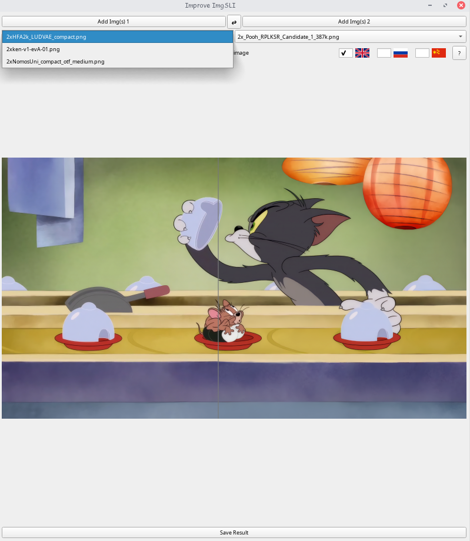
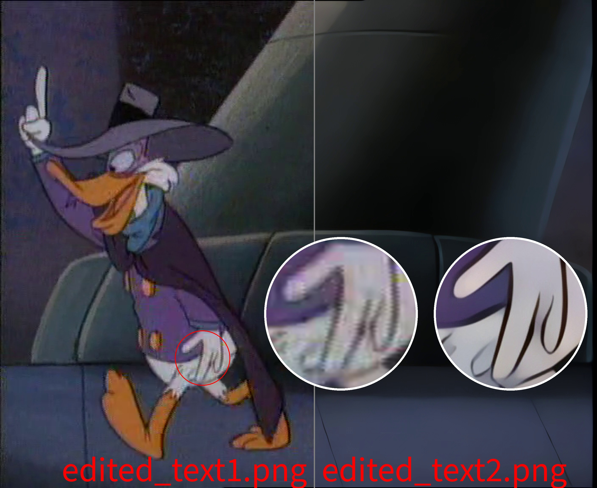

# Improved ImgSLI

<div style="display: flex; justify-content: space-between;">
    
    
    
</div>
<details>
     
</details>

## Overview
Improved ImgSLI is an open-source, non-proprietary software designed for intuitive image interactions. It is completely free of charge and allows for easy distribution without the need for a license.

## Features
- Intuitive image interactions using the mouse cursor
- Image splitting along horizontal and vertical axes
- Full-resolution image saving
- Magnifying glass feature with adjustable magnification area size
- Customizable magnifying glass mirror sizes
- Independent movement of magnifying glasses using the WASD keys
- Adjustable distance between magnifying glasses using the Q and E keys
- Ability to combine magnifying glasses for comparison
- Multilingual support (English, Russian, Chinese) with flag-based language selection
- Drag-and-drop support for loading one or multiple images per slot.
- Selection of loaded images via dropdown menus when multiple images are present in a slot.
- Swap entire image lists between slots with a single button click.
- Editable image names directly within the application interface.
- Option to include file names in the saved comparison image.
- Customizable font size and color for file names included in the saved image.
- Adjustable maximum length limit for displayed file names with visual warnings.
- Ability to freeze the magnifier's capture position.
- Support for dynamic window resizing with adaptive content rendering.
- Persistent settings for window state, language, and various display preferences across sessions.

---

## Installation
To install Improved ImgSLI via python, follow these steps:
```bash
git clone https://github.com/Loganavter/Improve-ImgSLI.git
cd Improve-ImgSLI
pip install -r requirements.txt
python Improve_ImgSLI.py
```

## Arch Linux 
```bash
yay -S improve-imgsli
```

## Windows
1. Download latest [realese](https://github.com/Loganavter/Improve-ImgSLI/releases/latest) ".exe" file
2. Install it

---

<details>
<summary>Development story</summary>
Originally, Improve ImgSLI was fully crafted by ChatGPT in September 2024 to simplify creating comparison images for my work, offering basic image comparison functionality. In October, I discovered Claude and used it to enhance the tool with a magnifier feature and drag-and-drop support.

By November, with Claude’s help, I refined the magnifier, adding options to freeze the detection area and merge magnifiers. However, the growing codebase—coupled with Claude’s 8k token context limit—made full regeneration impossible, forcing me to manually edit sections. I turned to Gemini, which assisted in integrating changes, though not all generated code was successful. Some features were postponed, and others were intentionally disabled to avoid bugs.

In early December, I experimented with adaptive magnifier positioning tied to window resizing, but the results were unsatisfactory, and I abandoned the effort. Then, in January 2025, a user request to enable window resizing prompted me to explore DeepSeek—a breakthrough AI with Chain-of-Thought reasoning at the time. DeepSeek helped implement this feature, while Gemini seamlessly incorporated it and other updates into the existing code.

In late February 2025, I resumed enhancing Improve ImgSLI. With Claude Sonnet 3.7, I added dynamic image swapping via a button, a language dictionary, and further magnifier improvements, along with a help tooltip in the top-right corner. Soon after, I gained access to Grok 3—first on X, then via its website after a quick Google search. Grok 3 proved invaluable: its DeepThink model efficiently resolved persistent bugs, outperforming DeepSeek, while its generous query limits and smart standard model kept development flowing smoothly. It optimized rendering updates, introduced file name display and editing, and fixed fullscreen mode issues.

Occasionally, I leaned on the new Claude Sonnet when Grok hit prediction snags—both AIs complemented each other, though Sonnet’s 16k token context eventually fell short too. Finally, Gemini 2.5 Pro Experimental recently became available; with its help, I was able to replace part of the PyQt logic with PIL, which was easier to work with. Also, with this AI, I managed to add a huge number of improvements, from displaying file names on the screen to the ability to load a list of files and customize all of it. Additionally, a massive number of bugs were fixed.

In general, if do not take into account the price of my personal time, which is about 2.5 weeks in total, then this project cost me about $ 30. I got the AUR maintainer for free, so we don't take it into account either :)
</details>
