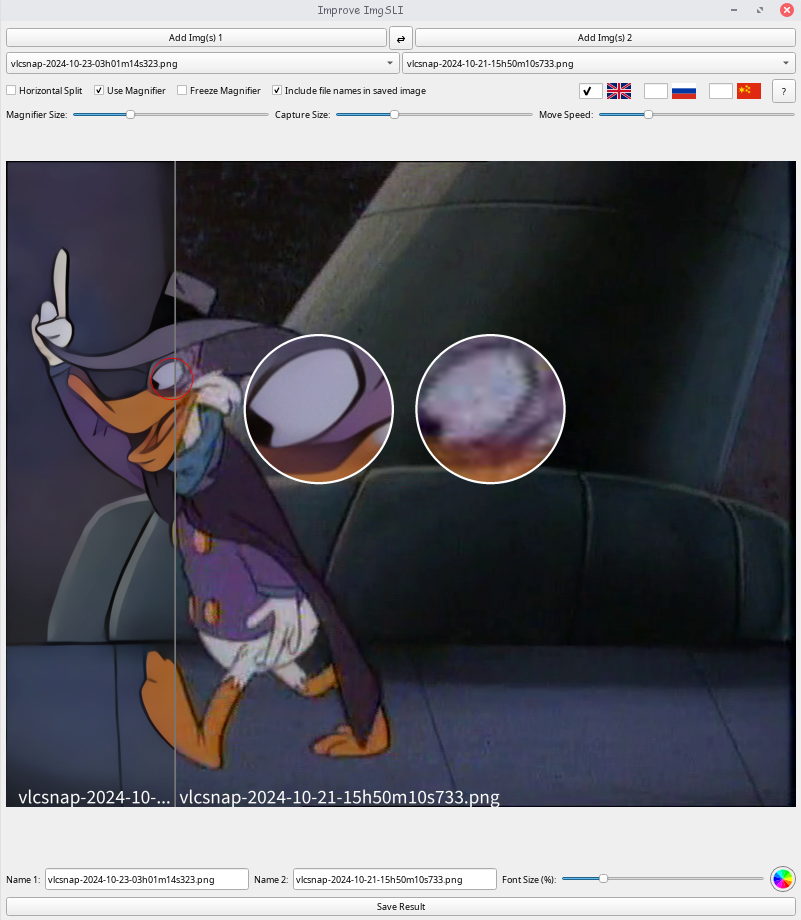
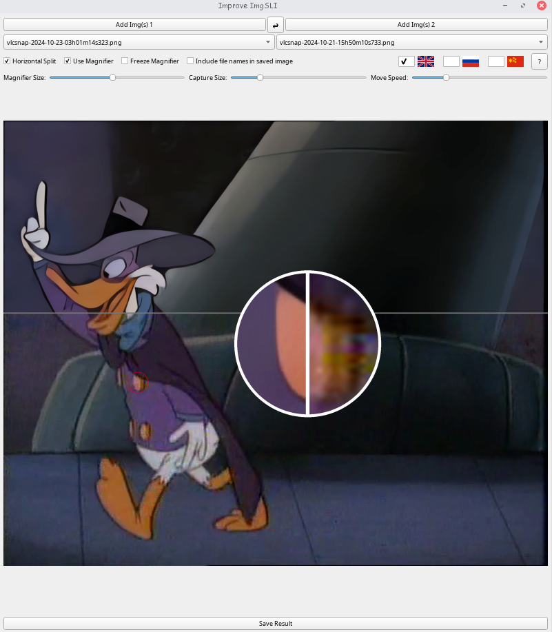
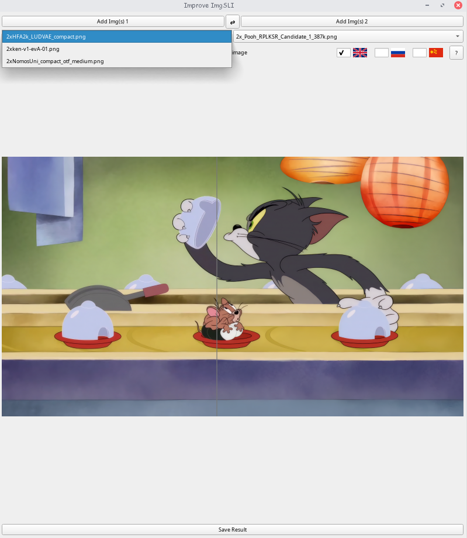
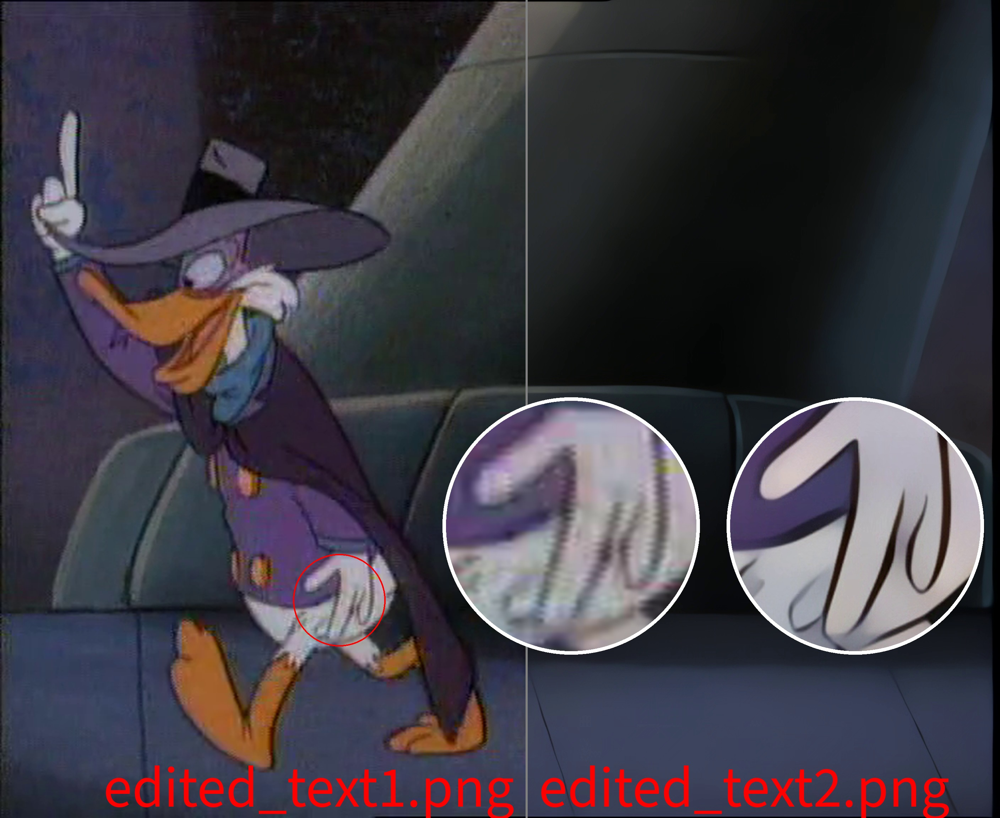

<div style="text-align: center;">
    
</div>

[](https://github.com/Loganavter/Improve-ImgSLI/releases/latest)
[](LICENSE)

**An intuitive, open-source tool for advanced image comparison and interaction.**

<div style="display: flex; justify-content: space-between;">
    
    
    
</div>
<details>
     <summary>Full resolution save</summary>
     

</details>

---

## Table of Contents

*   [Overview](#overview)
*   [Key Features](#key-features)
*   [Installation](#installation)
*   [Basic Usage](#basic-usage)
*   [Contributing](#contributing)
*   [License](#license)
*   [Development Story](#development-story)

---

## Overview <a name="overview"></a>

Improved ImgSLI is an open-source, non-proprietary software designed for intuitive image interactions. It's completely free, allowing easy distribution without restrictive licensing. It's built for anyone needing detailed image comparison, analysis, or manipulation, such as designers, upscale enthusiasts, photographers, or researchers.

---

## Key Features <a name="key-features"></a>

**Core Comparison & Viewing:**
*   Intuitive image splitting (horizontal/vertical) controlled by mouse.
*   Save the current comparison view as a full-resolution image.

**Magnifier Tool:**
*   Powerful magnifying glass for close inspection.
*   Adjustable magnification area size and mirror size.
*   Independent magnifier movement using WASD keys.
*   Adjust distance between magnifiers using Q and E keys.
*   Option to combine magnifiers for direct comparison of magnified areas.
*   Freeze the magnifier's capture position.

**File & Workflow Management:**
*   Drag-and-drop support for loading one or multiple images per slot.
*   Select loaded images via dropdown menus when multiple images are in a slot.
*   Swap entire image lists between slots with a single button click.
*   Edit image names directly within the application interface.
*   Option to include file names in the saved comparison image.
*   Customizable font size and color for included file names.
*   Adjustable maximum length for displayed file names with visual warnings.

**User Experience & Interface:**
*   Multilingual support (English, Russian, Chinese) with flag-based language selection.
*   Dynamic window resizing with adaptive content rendering.
*   Persistent settings for window state, language, and various display preferences across sessions.

---

## Installation <a name="installation"></a>

**Python (from source):**
*   Requires: Python, pip
*   Recommended: Use a virtual environment (`python -m venv venv`, then activate it).
```bash
git clone https://github.com/Loganavter/Improve-ImgSLI.git
cd Improve-ImgSLI
pip install -r requirements.txt
python Improve_ImgSLI.py
```

**Arch Linux (AUR):**
```bash
yay -S improve-imgsli
```

**Windows (Inno Setup):**
1.  Directly download it from [>>>here<<<](https://github.com/Loganavter/Improve-ImgSLI/releases/download/v2.3.1/Improve_ImgSLI.exe)
2.  Run the installer and follow the prompts.

**Flatpak (FlatHub):**
*   Very soon...

**MacOS:**
*   Coming soon... Stay tuned!

---

## Basic Usage <a name="basic-usage"></a>

1.  **Launch:** Start Improved ImgSLI using the method corresponding to your installation.
2.  **Load Images:** Drag and drop image files onto the left and right panels. If you drop multiple files onto one panel, use the dropdown menu above it to select the active image.
3.  **Compare:** Click and drag the mouse to move the separator line. Right-click to toggle between vertical and horizontal split.
4.  **Magnify:** Press the middle mouse button (scroll wheel) to activate the magnifying glass. Use WASD to move the magnifiers independently, Q/E to adjust their distance. Explore menus/tooltips for more options (like freezing or combining).
5.  **Save:** Click the save button in the UI to export the current comparison view as a single image file.

https://raw.githubusercontent.com/Loganavter/Improve-ImgSLI/v2.3.2/media/demo.mp4

---

## Contributing <a name="contributing"></a>

Contributions are welcome! Feel free to:
*   Report bugs or suggest features by opening an [Issue](https://github.com/Loganavter/Improve-ImgSLI/issues).
*   Submit improvements by creating a [Pull Request](https://github.com/Loganavter/Improve-ImgSLI/pulls). 

---

## License <a name="license"></a>

This project is distributed under the MIT License. See the [LICENSE](https://github.com/Loganavter/Improve-ImgSLI/blob/main/LICENSE.txt) file for more details.

---

[](https://star-history.com/#loganavter/Improve-ImgSLI&Date)

---

<details>
<summary>Development Story <a name="development-story"></a></summary>

Originally, Improve ImgSLI was fully crafted by ChatGPT in September 2024 to simplify creating comparison images for my work, offering basic image comparison functionality. In October, I discovered Claude and used it to enhance the tool with a magnifier feature and drag-and-drop support.

By November, with Claude’s help, I refined the magnifier, adding options to freeze the detection area and merge magnifiers. However, the growing codebase—coupled with Claude’s 8k token context limit—made full regeneration impossible, forcing me to manually edit sections. I turned to Gemini, which assisted in integrating changes, though not all generated code was successful. Some features were postponed, and others were intentionally disabled to avoid bugs.

In early December, I experimented with adaptive magnifier positioning tied to window resizing, but the results were unsatisfactory, and I abandoned the effort. Then, in January 2025, a user [request](https://github.com/Loganavter/Improve-ImgSLI/issues/1) to enable window resizing prompted me to explore DeepSeek—a breakthrough AI with Chain-of-Thought reasoning at the time. DeepSeek helped implement this feature, while Gemini seamlessly incorporated it and other updates into the existing code.

In February 2025, I resumed enhancing Improve ImgSLI. With Claude Sonnet 3.7, I added dynamic image swapping via a button, a language dictionary, and further magnifier improvements, along with a help tooltip in the top-right corner. Soon after, I gained access to Grok 3—first on X, then via its website after a quick Google search. Grok 3 proved invaluable: its DeepThink model efficiently resolved persistent bugs, outperforming DeepSeek, while its generous query limits and smart standard model kept development flowing smoothly. It optimized rendering updates, introduced file name display and editing, and fixed fullscreen mode issues.

In late March 2025, I focused on improving cross-platform compatibility. Gemini and Grok, utilizing their web search functions, helped draft the necessary build and packaging scripts. While I initially hoped for community assistance with maintaining builds for different platforms, skepticism from some potential contributors about the project's AI-assisted origins meant this became a solo undertaking. Consequently, preparing each platform release was time-intensive, taking considerable effort, though this thorough process did help uncover and resolve several remaining bugs before the successful launch of the cross-platform versions.

In general, if do not take into account the price of my personal time, which is about 3 weeks in total, then this project cost me about $ 30. I got the AUR maintainer for free, so we don't take it into account either :)
</details>
